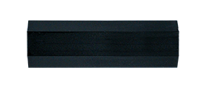
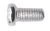

# 1. Introduction du Produit

**Adresse de téléchargement :** [https://fs.keyestudio.com/KS4036F](https://fs.keyestudio.com/KS4036F)

1. **Description**

Vous êtes-vous déjà demandé comment fonctionnent les dispositifs automatiques tels que les lumières et les portes automatiques ? 
Explorons cela ensemble ! 
La voiture robot intelligente KEYESTUDIO Microbit utilise une carte de contrôle micro:bit, un micro-ordinateur développé spécialement par la BBC pour l'éducation en programmation pour les adolescents.

La voiture est dotée d’un petit châssis, d'une structure simple et de trous compatibles avec des blocs. Plus important encore, elle est capable de détecter la distance et l'intensité de la lumière, de distinguer les lignes noires et blanches, et peut être contrôlée via Bluetooth et une télécommande infrarouge.

Elle dispose de tutoriels en deux langages, tels que la programmation graphique Makecode et Python, ce qui facilite la compréhension de la logique de programmation et le développement de la pensée informatique pour les débutants. La version de Python qui fonctionne sur le BBC micro:bit s'appelle MicroPython, dédiée à l'implémentation du langage de programmation Python dans les microcontrôleurs et systèmes embarqués.

Pour votre commodité, des explications détaillées sur le code sont fournies dans le tutoriel. En cas de difficultés ou de problèmes, n'hésitez pas à nous contacter.

2. **Caractéristiques**

- Elle est équipée de trous compatibles avec les Lego et est facile à transporter
- Câblage simple
- La carte Micro:Bit inclut un buzzer passif pour jouer de la musique de la bibliothèque Micro:Bit
- Deux LEDs RGB, qui peuvent être utilisées comme clignotants gauche ou droit pour la voiture, ou combinées pour créer un spectacle lumineux
- La vitesse du moteur peut être ajustée via le PWM

3. **Paramètres**

- Entrée du port de connexion : DC 4,5V
- Tension de fonctionnement des capteurs : 3V
- Vitesse du moteur : 200 tr/min
- Plage de température de fonctionnement : 0-50℃
- Dimensions : 99\*78\*58mm
- Conformité environnementale : ROHS

4. **Kit**

|     |                                                              | Composants                      | Qté |
|-----|--------------------------------------------------------------|---------------------------------|-----|
| 1   |               | Carte d'extension               | 1   |
| 2   |               | Plaque acrylique                | 1   |
| 3   |               | Capteur ultrasonique            | 1   |
| 4   |               | Roue multi directionnelle       | 1   |
| 5   |               | Roues                           | 2   |
| 6   |               | Colonne en nylon M3\*20mm       | 4   |
| 7   |               | Support de batterie 3AAA        | 1   |
| 8   |               | Vis à tête plate M3\*6MM        | 4   |
| 9   |               | Vis à tête plate M3\*10MM       | 6   |
| 10  |               | Écrous nickelés M3              | 2   |
| 11  |               | Tournevis plat                  | 1   |
| 12  |               | Tournevis cruciforme            | 1   |
| 13  |               | Télécommande infrarouge         | 1   |
