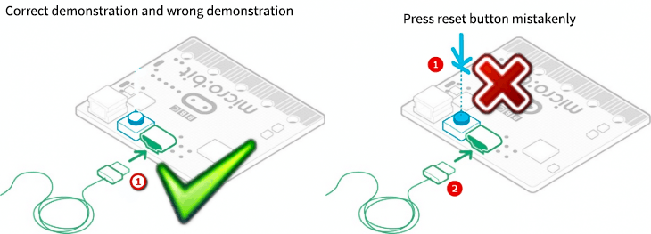

# Dépannage pour le Mode MAINTENANCE

**1. Problème**

Récemment, de nombreux utilisateurs rencontrent le problème de la carte Micro:bit qui ne répond pas lorsqu’elle est connectée à l’ordinateur.

Si votre manipulation est correcte, il est possible que vous ayez accidentellement appuyé sur le bouton de réinitialisation et activé le mode Maintenance, ou que vous ayez perdu le firmware en raison d'une mauvaise manipulation.

Lorsque la carte Micro:bit est branchée, le lecteur “MAINTENANCE” apparaît. Cela signifie que le programme ne peut pas être téléchargé.

**2. Solution**

Téléchargez le fichier hex depuis cette page sur votre ordinateur.

Téléchargez la dernière version du firmware---0257 :

[https://www.microbit.org/get-started/user-guide/firmware/](https://www.microbit.org/get-started/user-guide/firmware/)

Après avoir téléchargé la dernière version du firmware, glissez-la dans le lecteur “MAINTENANCE” comme illustré ci-dessous, ce qui permet de ramener la Micro:bit en mode normal.

**3. Comment éviter d’entrer en mode “MAINTENANCE” ?**

1. Assurez-vous que le bouton de réinitialisation n'est pas pressé lorsque vous branchez la carte avec le câble USB.

2. N’éteignez pas le câble de manière soudaine pendant le téléchargement du programme micro:bit, sinon le firmware sera perdu et la carte entrera en mode “MAINTENANCE”.

3. Lors des expériences, un mauvais câblage peut également causer un court-circuit ou entraîner la perte du firmware.
