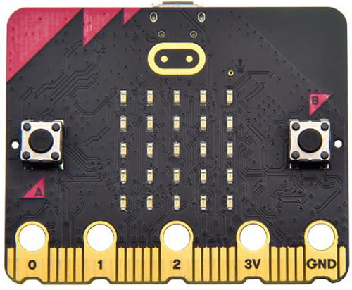
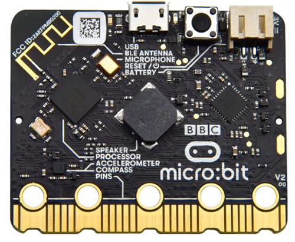
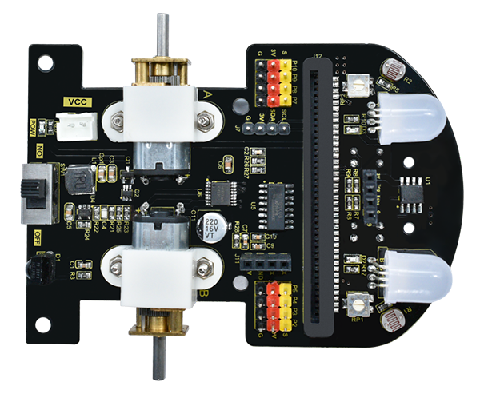

# 2. Carte mère et carte d'extension

Introduction à la Micro:bit

**1. Vue d'ensemble**

La Micro:bit est un microcontrôleur à architecture ARM conçu par la BBC, de la taille d'une demi-carte de crédit. Elle intègre cependant un Bluetooth, un accéléromètre, une boussole, trois boutons, une matrice LED 5 x 5 ainsi qu'un microphone.

La Micro:bit, conçue par la BBC, vise à engager les adolescents dans la programmation créative de matériel et de logiciels.

La Micro:bit propose de nombreuses bibliothèques open source et des solutions intéressantes que vous pouvez consulter sur le site web :

[Microsoft MakeCode pour Micro:bit (microbit.org)](https://makecode.microbit.org/)

Pour votre commodité, nous avons conçu une plaque de base pour la voiture en intégrant tous les types de capteurs nécessaires.

Ce produit est conçu pour la carte Micro:bit V2. Veuillez utiliser une carte de développement V2 pour le contrôle. (Si la carte de développement V1.5 est utilisée, certaines fonctions seront incompatibles.)

**2. Paramètres**

- **Processeur** : Nordic Semiconductor nRF52833
- **Mémoire** : 512kB Flash, 128kB RAM
- **Microphone** : Microphone MEMS avec indicateur LED
- **Haut-parleur** : Haut-parleur intégré
- **Logo tactile** : Logo sensible au toucher
- **Connecteur de bord** : Broches nécessitant une base spéciale, interfaces sur la carte : VCC, GND, P0, P1 et P2
- **Sans fil** : Radio/BLE BT 5.0 2,4 GHz
- **Alimentation** : 5V via le port Micro USB, 3V via le connecteur de bord ou un pack de batteries
- **Courant disponible** : 200mA
- **Capteur de mouvement** : ST LSM303
- **Logiciel** : Make Code, Python, Scratch
- **Dimensions** : 52\*43,2mm

**3. Fonctions**

- Haut-parleur intégré
- Microphone MEMS avec indicateur LED
- Logo sensible au toucher
- Mode veille ou arrêt intégré permettant d’éteindre le circuit sans retirer la batterie
- Régulateur de tension discrète pouvant fournir jusqu'à 200mA pour les accessoires périphériques
- Connecteur de bord facilitant la connexion de pinces crocodiles et de fils

**4. Brochage**

**5. Schéma de structure**

**6. Informations connexes**

[Micro:bit Educational Foundation \| micro:bit (microbit.org)](https://www.microbit.org/)

Voiture Robot Intelligente Microbit

**1. Vue d'ensemble**

La carte d'extension intègre un récepteur IR, une photorésistance, un capteur de suivi de ligne, des LEDs RGB, un port ultrasonique, une interface IIC, un port de communication série ainsi que des moteurs. De plus, elle offre huit ports IO pour une extension ultérieure.

En raison du nombre limité de ports IO de la Micro:bit, la carte Micro:bit envoie des instructions de contrôle à la STC8G1K08 via l'IIC, puis la ST8G1K08 envoie des signaux PWM pour contrôler le moteur HR8833, permettant ainsi de faire tourner le moteur. Les LEDs RGB sont contrôlées de la même manière.

**2. Paramètres**

- **Entrée du port de connexion** : DC 4,5V
- **Vitesse du moteur** : 200 tr/min
- **Plage de température de fonctionnement** : 0-50℃
- **Dimensions** : 99\*78\*58mm
- **Attributs de protection environnementale** : ROHS

**3. Schéma de la Carte d'Extension**

1.  Emplacement pour la carte Micro:bit
2.  Potentiomètre : ajuste les capteurs de suivi de ligne
3.  Photorésistance
4.  LED RGB
5.  Port ultrasonique
6.  Comparateur de tension LM393
7.  Capteurs de suivi de ligne
8.  Ports IO (Note : Certains ports IO sont utilisés par des fonctions sur la carte principale, ils ne peuvent donc pas être utilisés simultanément)
9.  Port de communication série : pour télécharger le programme STC8
10. Moteur : allumez d'abord l'alimentation
11. CI de réduction de tension ETA3413 : la tension d'entrée sera réduite à 3V
12. Récepteur IR
13. Interrupteur d'alimentation
14. Indicateur d'alimentation
15. Port d'alimentation externe
16. Port d'extension IIC
17. Moteur HR8833 : CI de commande
18. STC8G1K08 : CI de commande (la Micro:bit envoie des instructions via IIC pour contrôler le STC8)
