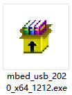

# 4. Installation du Pilote Microbit

**Étape 1**

Tout d'abord, connectez la Micro:bit à votre ordinateur en utilisant un câble USB, puis double-cliquez sur  pour installer.

Après avoir téléchargé le pilote, cliquez sur "Suivant".

Cliquez sur "Installer" puis "Terminer".

Ensuite, cliquez sur “Ordinateur” —\> “Propriétés” —\> “Gestionnaire de périphériques”, comme illustré ci-dessous.

