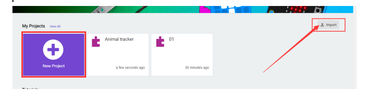
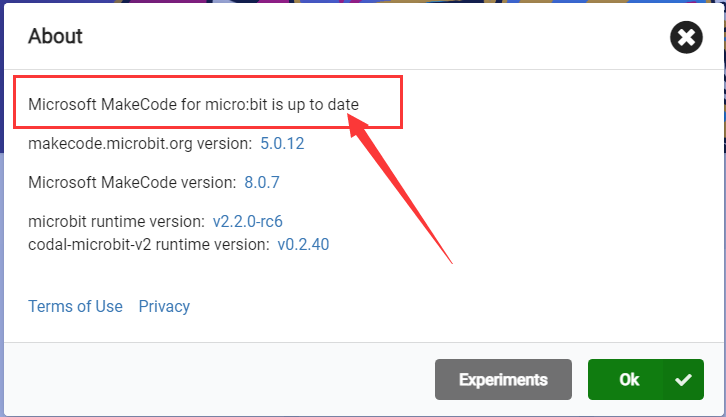
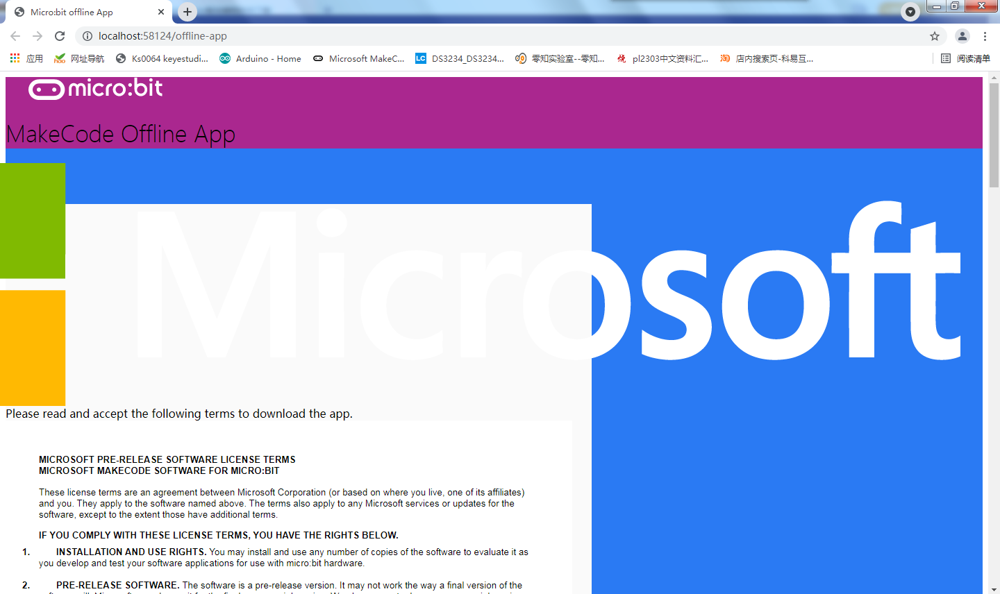
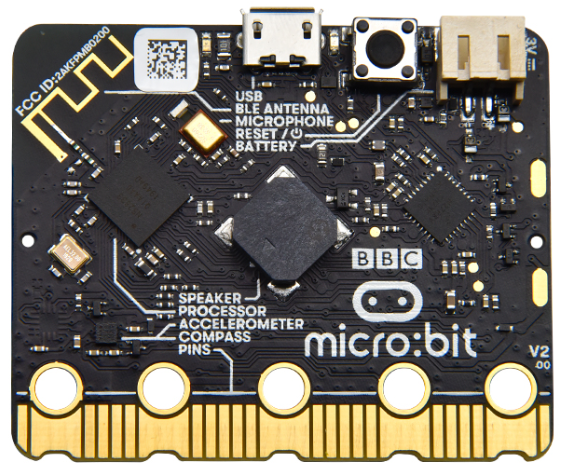
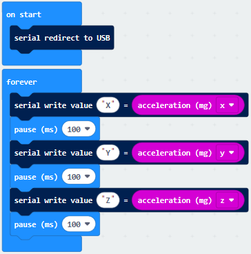
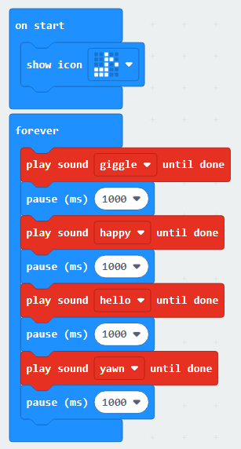
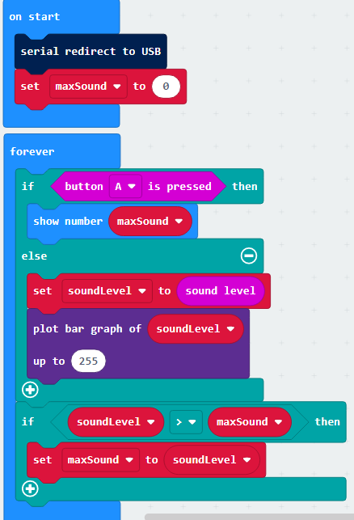
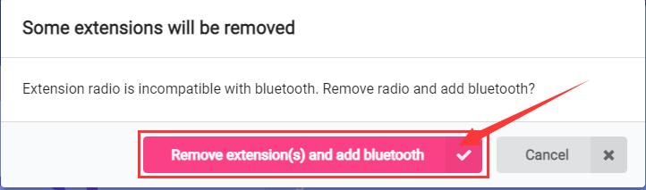
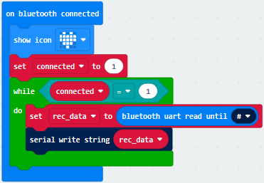
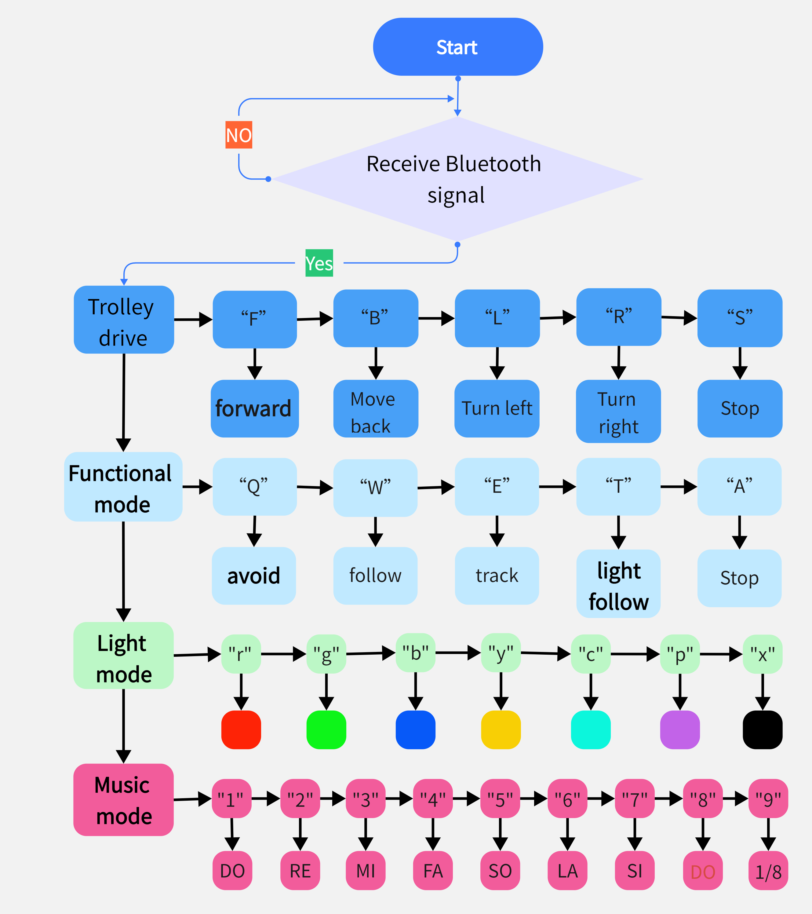

# 5. Tutoriel Makecode

## 5.1 Installer l'IDE

Micro:bit est un produit qui ne nécessite aucune installation d'IDE et il suffit de télécharger la programmation depuis le web : [Microsoft MakeCode pour micro:bit (microbit.org)](https://makecode.microbit.org/)

Si vous avez besoin d'une version hors ligne, consultez le fichier « Offline Makecode ».

## 5.2 Installer le pilote

Consultez le fichier “4. Installer le pilote Microbit”.

## 5.3 Configuration de l'IDE et présentation de la barre d'outils

Accédez au site : [Microsoft MakeCode pour micro:bit (microbit.org)](https://makecode.microbit.org/)

Si vous souhaitez importer le code existant, appuyez sur "Importer" → "Importer un fichier" → "Continuer".

Si vous devez écrire votre propre code, cliquez sur « Nouveau projet » et entrez le nom du projet.

① Zone de bloc de code : elle est subdivisée en plusieurs colonnes, chaque colonne contient les blocs de code correspondants, qui sont décrits sur le site web : <https://makecode.microbit.org/reference.>

② Zone d’écriture de code : notre code est complété dans cette zone. Il y a deux blocs de code dans le projet nouvellement créé.

③ Zone de configuration de l’environnement de programmation : nous pouvons y configurer la langue de l’environnement de développement et importer les fichiers de bibliothèque nécessaires.

④ Nom du projet

⑤ Bouton de téléchargement des projets

## 5.4 Télécharger le code

Entrez dans “Basic”→ “show icon” → “forever”.

Appuyez sur . Les ordinateurs Windows 10 peuvent le télécharger directement sur la carte de développement micro:bit.

Les ordinateurs Windows 7 doivent trouver le code téléchargé et sélectionner "Envoyer vers" microbit  ou copier et coller.

Si l'ordinateur n'affiche pas , veuillez vérifier selon les cinq fichiers.

### 5.5 Importer le Code

Connectez la carte de développement micro:bit à votre ordinateur via un câble USB, puis ouvrez la page de programmation en ligne MakeCode et cliquez sur **Importer**.

Ensuite, cliquez sur **Ajouter un dossier**, sélectionnez le fichier de code que vous souhaitez ajouter, et appuyez sur **Continuer** pour importer le code dans le compilateur en ligne.

### 5.6 Installer le Fichier de Bibliothèque

Pour importer dans MakeCode ou ajouter le code manuellement :

Appuyez sur **Extensions**.

Entrez le lien dans la barre de recherche, puis cliquez sur le fichier de bibliothèque nommé **Mini Car**.

Pour MakeCode hors ligne :

Lien de téléchargement :

[https://makecode.microbit.org/offline-app](https://makecode.microbit.org/offline-app)

### 5.7 Mettre à jour le Tutoriel

D'abord, ouvrez le logiciel et cliquez sur **Paramètres** dans le coin supérieur droit, puis sur **À propos**.

Allez dans l'interface **À propos** et cliquez sur la dernière version disponible.

Vous serez redirigé vers le site officiel du logiciel.

Faites défiler vers le bas et, par exemple, si votre système est Windows, sélectionnez **Windows** pour le téléchargement.

# 5.8 Projets de base pour Microbit

### Projet 1 : Battement de cœur

1. **Description**

   Les modules capteurs et la matrice LED du projet de base Microbit sont intégrés à la carte principale. Préparez une carte Micro:bit et un câble USB. Nous réaliserons une expérience de base où un motif de battement de cœur clignotera sur la carte Micro:bit.

2. **Composants Nécessaires**

   |  |  |   |
   |:----------------------------------------------------------:|:----------------------------------------------------------:|---|
   | Micro:bit * 1                                              | Câble USB * 1                                              |   |

3. **Code de Test**

   Vous pouvez importer le code directement depuis le tutoriel ou ajouter les blocs manuellement :

   1. Allez dans “Basic” → “show icon”.
   2. Copiez à nouveau et placez-le dans le bloc “forever”.
   3. Sélectionnez l'icône souhaitée.

   **Programme Complet :**

   

4. **Résultat du Test**

   Téléchargez le code sur la Micro:bit et connectez-la via un câble USB. La matrice LED affichera un motif de battement de cœur. Si le téléchargement échoue, déconnectez et redémarrez la Micro:bit.

---

### Projet 2 : Allumer une LED Unique

1. **Description**

   La carte Micro:bit est constituée de 25 diodes électroluminescentes disposées en une matrice de 5x5, que l'on peut contrôler en définissant des points de coordonnées.

2. **Composants Nécessaires**

   |  |  |   |
   |:----------------------------------------------------------:|:----------------------------------------------------------:|---|
   | Micro:bit * 1                                              | Câble USB * 1                                              |   |

3. **Code de Test**

   **Étapes de code :**

   1. Activez “Led” → “more” → “led enable false” dans le bloc “on start”, puis sélectionnez “true”.
   2. Allez dans “Led” → “toggle x 0 y 0” et combinez-le avec “forever” en modifiant “x 0” en “x 1”.
   3. Ajoutez une pause (ms) pour régler la durée de clignotement.

   **Programme Complet :**

   

4. **Résultat du Test**

   Téléchargez le programme et connectez la Micro:bit via le port USB. La LED située aux coordonnées (1,0) clignotera pendant 0,5 seconde, suivie par celle aux coordonnées (3,4), alternant ainsi.

---

### Projet 3 : Matrice LED 5x5

1. **Description**

   La matrice LED est utilisée dans de nombreux domaines, tels que les écrans LED et les panneaux d'affichage. La matrice de la Micro:bit se compose de 25 diodes, et nous pouvons contrôler l'affichage en utilisant des points de coordonnées.

2. **Composants Nécessaires**

   |  |  |   |
   |:----------------------------------------------------------:|:----------------------------------------------------------:|---|
   | Micro:bit * 1                                              | Câble USB * 1                                              |   |

3. **Code de Test**

   **Code 1 : Affichage d'icônes sur la matrice**

   Activez les LED dans différentes positions pour créer des motifs. 

   **Programme Complet :**

   

   **Code 2 : Affichage de nombres et de motifs**

   1. Utilisez “show number” pour afficher les nombres de 0 à 5.
   2. Affichez des motifs en utilisant les LED et les flèches directionnelles.

   **Programme Complet :**

   

4. **Résultat du Test**

   Téléchargez le code 1, et la matrice LED affichera des motifs spécifiques. Téléchargez le code 2, et la Micro:bit affichera une série de nombres suivie des messages et icônes configurés, en boucle.
   
### Projet 4 : Boutons Programmables

1. **Description**

   Le bouton peut contrôler l'ouverture et la fermeture du circuit auquel il est relié. Lorsque le bouton n'est pas pressé, le circuit est déconnecté. Il se connecte dès que le bouton est pressé, mais se déconnecte de nouveau une fois relâché.

   Les deux extrémités du bouton sont comme deux montagnes séparées par une rivière. Une pièce métallique interne relie les deux côtés, permettant au courant de passer, comme un pont reliant deux montagnes.

   
   

   - **Structure interne**

     Principe de fonctionnement : Avant d'appuyer sur le bouton, 1, 2, 3 et 4 sont connectés, mais 1 et 3, 1 et 4, 2 et 3, ou 2 et 4 sont déconnectés (bloqués). Ils se connectent lorsque le bouton est pressé.

   La carte Micro:bit possède trois boutons : un bouton de réinitialisation au dos et deux boutons programmables à l'avant. Lorsque les boutons A, B, ou les deux (AB) sont pressés respectivement, l'écran affiche le caractère correspondant.

2. **Composants Nécessaires**

   |  |  | |
   |:----------------------------------------------------------:|:----------------------------------------------------------:|:-------------------:|
   | Micro:bit * 1                                              | Câble USB * 1                                              |                     |

3. **Code de Test**

   Vous pouvez importer le code directement depuis le tutoriel (consultez le fichier de **Configuration de l'Environnement de Développement** si besoin).

   **Code 1 :**

   1) A. Cliquez sur “Basic” → “show string” ;
      B. Placez-le dans le bloc “on button A pressed”, changez “Hello!” en “A”.
      

   2) Copiez le bloc **show string** , cliquez sur le menu déroulant pour sélectionner “B” et modifiez “A” en “B”.
      

   3) Copiez  et définissez-le sur “on button A+B pressed” et “show string AB”.
      

   **Programme Complet :**

   

   **Code 2 :**

   1) A. Cliquez sur “Led” → “more” → “led enable false” ;
      B. Placez-le dans le bloc “on start”, sélectionnez “true” dans le menu déroulant.
      

   2) A. Cliquez sur “Input” → “on button A pressed” ;
      B. Allez dans “Variables” → “change item by 1” ;
      C. Placez-le dans “on button A pressed” et remplacez le 1 par 1.
      

   3) Dupliquez , sélectionnez “B” dans le menu déroulant, puis définissez “change item by -5”.
      

   4) A. Entrez “Led” → “plot bar graph of 0 up to 0” ;
      B. Placez-le dans le bloc “forever” ;
      C. Allez dans “Variables” et déplacez “item” dans la case 0, puis remplacez 0 par 25.
      

   5) A. Allez dans “Logic” pour ajouter les blocs “if...true...then...” et “=” ;
      B. Placez “=” dans la case “true” et définissez-le sur “>” ;
      C. Sélectionnez “item” dans “Variables” et placez-le dans la case de gauche de “>”, puis remplacez 0 par 25 ;
      D. Dans “Variables”, faites glisser “set item to 0” dans “if...true..then...”, remplacez 0 par 25.
      

   6) A. Dupliquez le bloc  ;
      B. Modifiez “>” en “<” et changez 25 en 0 ;
      C. Placez-le sous le bloc .

      

   **Programme Complet :**

   

4. **Résultat du Test**

   Chargez le Code 1 et connectez le micro:bit via un câble USB, puis appuyez sur le bouton “A” du micro:bit pour afficher le caractère “A”. Si le bouton “B” est pressé, la lettre “B” apparaît, et si les boutons A et B sont pressés en même temps, “AB” est affiché.

   Chargez le Code 2 et connectez la carte via un câble USB. Lorsque vous appuyez sur le bouton A, le nombre de rangées allumées sur la matrice de LED augmente ; lorsque le bouton B est pressé, le nombre de rangées allumées diminue.
   ### Projet 5 : Mesure de la Température

1. **Description**

   La carte principale Micro:bit n'est pas équipée d'un capteur de température, mais elle peut détecter la température via le capteur de température intégré dans la puce NFR51822. Ainsi, la température détectée est plus proche de celle de la puce que de l'environnement.

   Dans ce projet, nous utiliserons le capteur pour tester la température ambiante, afficher les résultats sur un équipement de visualisation de données, puis définir une plage de température pour contrôler l'affichage de différents motifs sur la matrice de LED.

   

2. **Composants Nécessaires**

   |  |  | |
   |:----------------------------------------------------------:|:----------------------------------------------------------:|:-------------------:|
   | Micro:bit * 1                                              | Câble USB * 1                                              |                     |

3. **Code de Test**

   Vous pouvez importer le code directement depuis le tutoriel (consultez le fichier de **Configuration de l'Environnement de Développement** si besoin).

   **Code 1 :**

   1) Allez dans “Advanced” → “Serial” → “serial redirect to USB” et placez-le dans “on start”.
      

   2) Cliquez sur “Serial” pour faire glisser “serial write value x=0” et placez-le dans le bloc “forever”.
      

   3) Allez dans “Input” → “temperature(℃)” et placez-le dans la case 0, puis changez “x” en “Temperature”.
      

   4) Déplacez “pause (ms) 100” du bloc “Basic” et placez-le sous le bloc “serial write.....temperature(℃)”.
      

   **Programme Complet :**

   

   Téléchargez le code 1 sur la carte Micro:bit et maintenez le câble USB connecté. La température sera affichée dans un moniteur série.

4. **Résultat du Test**

   Pendant le test, la température ambiante est d'environ 35℃ lorsqu'on touche la puce NFR5182 de la Micro:bit, et elle monte à 37℃ au contact d'une tasse d'eau chaude.

**Code 2 :**

1) Cliquez sur “Led” → “more” → “led enable false” dans “on start” et sélectionnez “true”.
   

2) Allez dans “Logic” → “if..true...then...else” et insérez-le dans le bloc “forever”, puis définissez “≥” pour contrôler l'affichage basé sur la température (ex. 35℃).
   

3) Configurez les icônes en fonction de la température détectée (exemple : afficher un motif différent selon la température).
   
### Projet 5 : Mesure de la Température

1. **Description**

   La carte principale de la Micro:bit n’est pas équipée d’un capteur de température, mais elle peut détecter la température grâce au capteur intégré de la puce NRF51822. La température mesurée est donc proche de celle de la puce. Dans ce projet, nous utiliserons ce capteur pour tester la température de l’environnement actuel et afficher les résultats sur l'écran LED de la Micro:bit. Nous définirons ensuite une plage de température détectée pour afficher différents motifs sur la matrice LED.

   

2. **Composants Nécessaires**

   |  |  |   |
   |:----------------------------------------------------------:|:----------------------------------------------------------:|---|
   | Micro:bit * 1                                              | Câble USB * 1                                              |   |

3. **Code de Test**

   **Code 1 : Transmission des données de température via le port série**

   1. Allez dans “Advanced” → “Serial” → “serial redirect to USB” et placez-le dans le bloc “on start”.
   2. Cliquez sur “Serial” pour ajouter “serial write value x=0” dans le bloc “forever”.
   3. Allez dans “Input” → “temperature(℃)” et placez-le dans la case “0”. Modifiez "x" en "Température".
   4. Ajoutez une pause (ms) pour régler la fréquence de transmission.

   **Programme Complet :**

   

   Téléchargez le code sur la carte Micro:bit et maintenez-la connectée via le câble USB. Les données de température seront affichées dans le moniteur série.

   - **Résultats du Test** : La température de la pièce mesurée est de 35°C, mais elle augmente à 37°C lorsqu'on touche la Micro:bit avec un gobelet d'eau chaude.

   **Utilisation de CoolTerm pour lire les données série** : 
   Ouvrez CoolTerm, sélectionnez le port série (COM) et réglez la vitesse à 115200 baud. Cliquez sur “Connect” pour afficher les valeurs de température.

4. **Code 2 : Affichage de la température sur la matrice LED**

   1. Activez les LED avec “led enable false” dans “on start”, puis sélectionnez “true”.
   2. Utilisez un bloc logique “if...then...else” pour vérifier si la température est supérieure ou égale à 35°C.
   3. Utilisez le bloc “show icon” pour afficher différents motifs selon la température.

   **Programme Complet :**

   

5. **Résultat du Test**

   Téléchargez le code sur la Micro:bit et connectez-la. Lorsque la température ambiante est inférieure à 35°C, la matrice LED affiche un motif particulier. Lorsque la température est supérieure ou égale à 35°C, un autre motif s'affiche.
### Projet 6 : Boussole

1. **Description**

   Ce projet présente l'utilisation de la boussole de la Micro:bit. Il est nécessaire de calibrer la carte Micro:bit en la faisant tourner. Les objets proches peuvent affecter la précision des lectures et de la calibration.

   

2. **Composants Nécessaires**

   |  |  | |
   |:----------------------------------------------------------:|:----------------------------------------------------------:|:-------------------:|
   | Micro:bit * 1                                              | Câble USB * 1                                              |                     |

3. **Code de Test**

   **Code 1 :**

   1) Cliquez sur “Input” → “more” → “calibrate compass” et placez-le dans le bloc “on start”.
      

   2) Allez dans “Input” → “on button A pressed” pour afficher l'angle de la boussole lorsque le bouton A est pressé.
      

   **Programme Complet :**

   

4. **Description du Programme**

   Téléchargez le code 1, connectez la Micro:bit via USB et pressez le bouton A pour afficher des angles de boussole comme 0°, 90°, 180° et 270°.

   **Code 2 :** 

   Ce code utilise les lectures de boussole pour déterminer les directions (nord, sud, est, ouest) et afficher des flèches correspondantes sur la matrice LED.
   

   ### Projet 7 : Accéléromètre

1. **Description**

   La carte Micro:bit possède un capteur d'accélération intégré, le LSM303AGR. Ce capteur permet de détecter les mouvements dans les trois dimensions (axes X, Y, Z) avec une résolution de 8, 10 ou 12 bits, et des plages de mesure de 1g, 2g, 4g ou 8g. Ce projet utilise l'accéléromètre pour détecter plusieurs postures spécifiques et visualiser les données brutes des trois axes.

2. **Composants Nécessaires**

   |  |  |   |
   |:----------------------------------------------------------:|:----------------------------------------------------------:|---|
   | Micro:bit * 1                                              | Câble USB * 1                                              |   |

3. **Code de Test**

   **Code 1 : Détection de Postures**

   1. Allez dans “Input” → “on shake”.
   2. Dans “Basic”, sélectionnez “show number” et mettez-le dans le bloc “on shake”. Remplacez le nombre par 1.
   3. Dupliquez ce code pour les postures “logo up”, “logo down”, “screen up”, “screen down”, “tilt left”, “tilt right” et “free fall”, en changeant le nombre pour chaque posture.

   **Programme Complet :**

   

   **Code 2 : Vérification de l’Accélération sur les Axes X, Y et Z**

   1. Allez dans “Advanced” → “Serial” → “serial redirect to USB” et placez-le dans le bloc “on start”.
   2. Dans “Serial”, sélectionnez “serial write value x=0” et placez-le dans le bloc “forever”.
   3. Dans “Input”, choisissez “acceleration(mg) x”, remplacez "0" par "x".
   4. Répétez les étapes pour les axes Y et Z.

   **Programme Complet :**

   

4. **Résultat du Test**

   Téléchargez le code sur la Micro:bit. En secouant la carte, le nombre 1 s'affiche pour le shake, et chaque posture affiche un nombre spécifique. Les valeurs des axes X, Y et Z sont également visibles via le port série.

---

### Projet 8 : Détecter l'Intensité Lumineuse

1. **Description**

   Ce projet utilise la matrice LED de la Micro:bit pour détecter l'intensité lumineuse environnante en mesurant le temps de décharge de tension.

2. **Composants Nécessaires**

   |  |  |   |
   |:----------------------------------------------------------:|:----------------------------------------------------------:|---|
   | Micro:bit * 1                                              | Câble USB * 1                                              |   |

3. **Code de Test**

   1. Dans “Advanced” → “Serial” → “serial redirect to USB” et placez-le dans le bloc “on start”.
   2. Dans “Serial”, sélectionnez “serial write value x=0” et mettez-le dans “forever”.
   3. Dans “Input”, choisissez “Light level”, remplacez "x" par "Light intensity".

   **Programme Complet :**

   

4. **Résultat du Test**

   Téléchargez le code sur la Micro:bit et visualisez l’intensité lumineuse sur le moniteur série. La valeur augmente lorsque la Micro:bit est exposée à la lumière et diminue lorsqu’elle est recouverte.

---

### Projet 9 : Haut-Parleur

1. **Description**

   La carte Micro:bit est équipée d'un haut-parleur intégré, permettant de jouer des sons. Vous pouvez programmer des mélodies et les jouer directement.

2. **Composants Nécessaires**

   |  |  |   |
   |:----------------------------------------------------------:|:----------------------------------------------------------:|---|
   | Micro:bit * 1                                              | Câble USB * 1                                              |   |

3. **Code de Test**

   1. Dans “Basic” → “show icon”, choisissez un icône de musique et placez-le dans “on start”.
   2. Dans “Music”, sélectionnez des sons comme “happy”, “hello” et “yawn” et placez-les dans le bloc “forever” avec une pause entre chaque son.

   **Programme Complet :**

   

4. **Résultat du Test**

   Téléchargez le programme et connectez la Micro:bit. Le haut-parleur émet des sons et l’icône de musique s'affiche sur la matrice LED.
   ### Projet 10 : Logo Sensible au Toucher

1. **Description**

   La carte Micro:bit possède un logo doré qui peut agir comme un capteur tactile capacitif. Ce capteur détecte de petits changements de champ électrique lorsque vous le touchez, ce qui permet de contrôler diverses fonctions du Micro:bit.

   

2. **Composants Nécessaires**

   |  |  |   |
   |:----------------------------------------------------------:|:----------------------------------------------------------:|---|
   | Micro:bit * 1                                              | Câble USB * 1                                              |   |

3. **Code de Test**

   1. Supprimez les blocs “on start” et “forever”.
   2. Dans “Input”, choisissez “when logo is touched”, puis sélectionnez “is touched”.
   3. Créez une variable “start” et configurez-la pour capturer l'heure de début au moment du toucher.
   4. Créez une variable “time” et configurez-la pour calculer le temps écoulé lorsque le logo est relâché.

   **Programme Complet :**

   

4. **Résultat du Test**

   Téléchargez le programme et connectez le Micro:bit. En appuyant sur le logo, un cœur apparaît sur la matrice LED. Lorsque vous relâchez, un nombre s’affiche indiquant le temps pendant lequel le logo a été maintenu.

---

### Projet 11 : Microphone

1. **Description**

   Le Micro:bit dispose d’un microphone intégré qui peut mesurer le niveau sonore ambiant. Lorsqu’un bruit fort est détecté, le voyant du Micro:bit s'allume.

   

2. **Composants Nécessaires**

   |  |  |   |
   |:----------------------------------------------------------:|:----------------------------------------------------------:|---|
   | Micro:bit * 1                                              | Câble USB * 1                                              |   |

3. **Code de Test**

   **Code 1 : Réaction au bruit**

   1. Configurez le Micro:bit pour afficher un cœur lorsque le niveau sonore est élevé et un visage triste lorsqu’il est faible.

   **Programme Complet :**

   

   **Code 2 : Enregistrement du niveau sonore maximum**

   1. Créez une variable `maxSound` pour enregistrer le niveau sonore maximum détecté et affichez-le en appuyant sur le bouton A.

   **Programme Complet :**

   

4. **Résultat du Test**

   Téléchargez le code 1 et observez le Micro:bit afficher des motifs en fonction du bruit. Pour le code 2, appuyez sur le bouton A pour voir le niveau sonore maximal enregistré.

---

### Projet 12 : Communication Sans Fil Bluetooth

1. **Description**

   Le Micro:bit est équipé de Bluetooth 5.1 pour la communication sans fil. Ce projet montre comment connecter un Micro:bit à un téléphone ou une tablette via Bluetooth.

   

2. **Composants Nécessaires**

   |  |  |   |
   |:----------------------------------------------------------:|:----------------------------------------------------------:|---|
   | Micro:bit * 1                                              | Câble USB * 1                                              |   |

3. **Instructions de Connexion**

   - Téléchargez le fichier HEX de couplage depuis le site de Micro:bit et transférez-le sur votre carte.
   - Utilisez l’application mobile Micro:bit pour connecter le Micro:bit en suivant les instructions d'appairage.

4. **Résultat du Test**

   Une fois connecté, utilisez l'application pour programmer le Micro:bit via Bluetooth. L'icône de connexion et un motif de cœur s'affichent sur la matrice LED.

---

### Projet 13 : Module LED RGB

1. **Description**

   Les LEDs RGB utilisent les trois couleurs de base (rouge, vert, bleu) pour créer une palette de couleurs. Ce projet explore l'éclairage de LEDs RGB pour afficher des couleurs variées et un effet de lumière respirante.

2. **Préparation**

   - Insérez correctement le Micro:bit dans la carte d'extension.
   - Connectez le support de piles et allumez le Micro:bit.

3. **Diagramme Schématique**

   

4. **Code Explicatif**

   Configurez les couleurs des LEDs avec la bibliothèque MiniCar, en utilisant des valeurs de PWM pour contrôler la luminosité.

5. **Code de Test**

   **Code 1 : Changement de couleur RGB**

   Utilisez les blocs de la bibliothèque MiniCar pour alterner les couleurs des LEDs toutes les secondes.

   **Programme Complet :**

   

6. **Effet de Lumière Respirante**

   Chargez un code supplémentaire pour créer un effet de mélange progressif des couleurs.

   **Code Complémentaire :**

   

7. **Connaissances Complémentaires**

   Comprenez les conversions de temps en millisecondes et ajustez les valeurs PWM pour configurer les couleurs.
   ### Projet 14 : Contrôle des Moteurs

1. **Description**

La voiture robot est équipée de deux moteurs à courant continu avec réducteur, conçus pour offrir une vitesse réduite mais un couple plus élevé. Les réducteurs permettent de modifier le rapport de vitesse et de couple en fonction des besoins. Pour économiser les ports d'entrée/sortie, la voiture utilise la puce STC8G1K08 pour envoyer des instructions via le port IIC au micro:bit. La puce STC8G1K08 contrôle ensuite la puce HR8833MTE pour gérer la direction et la vitesse des moteurs.

   

2. **Préparation**

   - Insérez correctement la carte micro:bit dans la carte d'extension.
   - Connectez le porte-piles à la carte d'extension.
   - Activez l'interrupteur d'alimentation (position ON).
   - Connectez le micro:bit à l’ordinateur via un câble USB.
   - Ouvrez la version Web de MakeCode.
   - Si vous ajoutez manuellement les blocs de code, commencez par ajouter la bibliothèque Mini Car.

3. **Schéma de Circuit**

   
   
   

4. **Explication du Code**

   Faites glisser le module de contrôle des moteurs depuis la barre MiniCar dans la zone de programmation. Le bloc de code permet de sélectionner le moteur (A ou B), de définir la direction (avant/arrière) et de régler la vitesse (de 0 à 255).

   

   - **① Sélection du moteur :** permet de choisir entre les moteurs A et B.
   - **② Direction du moteur :** permet de définir la direction (avant/arrière).
   - **③ Vitesse du moteur :** permet de définir la vitesse du moteur (0 à 255).

5. **Code de Test**

   Téléchargez le code depuis le tutoriel ou ajoutez manuellement les blocs de code pour contrôler la voiture. Les fonctions du code permettent de :
   - Avancer pendant 1 seconde,
   - Reculer pendant 1 seconde,
   - Tourner à gauche pendant 1 seconde,
   - Tourner à droite pendant 1 seconde,
   - S’arrêter pendant 1 seconde.

   Exemple de code pour avancer pendant 1 seconde :

   - Configurez les moteurs A et B en "avant" avec une vitesse de 100, puis ajoutez un délai de 1 seconde.

6. **Résultat du Test**

   Téléchargez le code sur la carte micro:bit, puis allumez l'interrupteur à l'arrière de la voiture. La voiture effectuera les mouvements programmés : avancer, reculer, tourner à gauche, tourner à droite et s’arrêter.

7. **Connaissances Supplémentaires**

   - **Pour tourner à gauche :** configurez le moteur A en arrière et le moteur B en avant, ou réglez des vitesses différentes sur les deux moteurs pour dévier vers la gauche.
   - **Pour tourner à droite :** appliquez la même logique en inversant les moteurs.
### Projet 15 : Voiture Suiveuse de Lumière

1. **Description**

Vous avez peut-être remarqué que les lampadaires s’allument lorsqu’il fait sombre et s’éteignent à l’aube. Ce phénomène est dû à un composant nommé "photo-résistance".

Principe de fonctionnement : La photo-résistance est un type de résistance dont la valeur change en fonction de la lumière ambiante. Lorsque l’intensité lumineuse augmente, la résistance diminue et la tension sur le port analogique du microcontrôleur augmente (la valeur analogique augmente). À l’inverse, quand l’intensité lumineuse diminue, la résistance augmente et la tension baisse (la valeur analogique diminue). Ce principe est utilisé dans ce projet pour permettre à la voiture de suivre une source lumineuse.

Dans ce projet, nous utiliserons des photo-résistances (gauche et droite) pour contrôler la voiture et lui permettre de trouver la source lumineuse.

2. **Préparation**

   - Insérez correctement la carte micro:bit dans la carte d'extension.
   - Connectez le porte-piles à la carte d'extension.
   - Activez l'interrupteur d'alimentation (position ON).
   - Connectez le micro:bit à l’ordinateur via un câble USB.
   - Ouvrez la version Web de MakeCode.
   - Si vous choisissez d'ajouter les blocs de code manuellement, commencez par ajouter la bibliothèque Mini Car.

3. **Schéma du Circuit de la Photo-résistance**

   

4. **Explication du Code**

   Dans le menu des capteurs photosensibles de “MiniCar”, retrouvez "LDR_R" et "LDR_L".

   - **LDR_R** : Bloc de code pour obtenir la valeur de la photo-résistance de droite.
   - **LDR_L** : Bloc de code pour obtenir la valeur de la photo-résistance de gauche.

5. **Lecture de la Photo-résistance**

   Vous pouvez télécharger le code "1-ReadLight.hex" ou ajouter les blocs de code manuellement.

   **Étape 1 :** Configurez le cadre de code pour l’impression des valeurs sur le port série en plaçant le bloc "serial redirect to USB" dans "on start".

   **Étape 2 :** Ajoutez le bloc "serial write value" dans le module “forever” et configurez-le pour afficher la valeur de "LDR_R" et "LDR_L" en continu avec un délai de 1 seconde.

6. **Organigramme**

   

7. **Voiture Suiveuse de Lumière**

   Téléchargez le fichier "2-LightFollow.hex" dans le dossier "Programs".

   **Code : Détecter la valeur analogique des photo-résistances**

   - Créez deux nouvelles variables, "ldr_l" et "ldr_r", et assignez les valeurs de "LDR_L" et "LDR_R" respectivement.
   - Utilisez un bloc "if" dans la catégorie "Logic" pour vérifier si les valeurs de "ldr_l" et "ldr_r" sont toutes deux supérieures à 650. 

   - **Code pour avancer** : Si les valeurs gauche et droite sont toutes deux supérieures à 650, ajoutez le code "la voiture avance" et réglez la vitesse à 100.
   - **Code pour tourner à gauche** : Si la valeur de gauche est supérieure à 650 et celle de droite est inférieure ou égale à 650, la voiture tourne à gauche avec une vitesse de 100.
   - **Code pour tourner à droite** : Si la valeur de droite est supérieure à 650 et celle de gauche est inférieure ou égale à 650, la voiture tourne à droite avec une vitesse de 100.
   - **Arrêt de la voiture** : Si aucune des conditions précédentes n'est remplie, la voiture s'arrête.

   

8. **Résultat du Test**

   Après avoir téléchargé le code, allumez l’interrupteur à l’arrière de la voiture. Utilisez une lampe de poche pour diriger la voiture dans un environnement faiblement éclairé. Lorsque l'intensité lumineuse ambiante est supérieure à 650, la voiture continue de bouger.

9. **Connaissances Supplémentaires**

   Pour plus d’informations sur les blocs de code, consultez le site officiel de MakeCode : [https://makecode.microbit.org/reference/](https://makecode.microbit.org/reference/)

   ### Projet 16 : Voiture Suiveuse de Ligne

1. **Description**

La voiture est équipée de deux capteurs de suivi de ligne et de deux potentiomètres.

Elle utilise un tube infrarouge TCRT5000, contenant un émetteur et un récepteur infrarouge. Lorsque les signaux infrarouges émis sont réfléchis par une surface, le récepteur les capte et sa résistance varie en fonction de l’intensité des signaux. Ce phénomène provoque un changement de tension dans le circuit. 

Principe de fonctionnement : Lorsque la voiture roule sur une surface blanche, le récepteur capte les signaux et l’émetteur de la voiture émet des signaux infrarouges qui sont réfléchis. Dans ce cas, la sortie est un niveau bas (0). Lorsqu'elle détecte des lignes noires, elle produit un niveau haut (1).

Les deux capteurs de suivi de ligne sur la carte d'extension sont contrôlés par les broches P12 et P13 du micro:bit. Le capteur de gauche est contrôlé par P13 et celui de droite par P12. Placez la voiture sur une surface noire, ajustez les potentiomètres pour allumer les LED (D3, D2), puis réglez-les jusqu'à ce qu'elles s’éteignent.

2. **Préparation**

   - Insérez correctement la carte micro:bit dans la carte d'extension.
   - Connectez le porte-piles à la carte d'extension.
   - Activez l'interrupteur d'alimentation (position ON).
   - Connectez le micro:bit à l’ordinateur via un câble USB.
   - Ouvrez la version Web de MakeCode.
   - Ajoutez la bibliothèque Mini Car si vous souhaitez créer les blocs de code manuellement.

3. **Schéma du Circuit**

   

4. **Lecture du Capteur de Suivi de Ligne**

   Vous pouvez télécharger le code “1-ReadSensor.hex” ou ajouter les blocs de code manuellement.

   - **Étape 1 :** Configurez un cadre pour l’impression série en plaçant le bloc "serial redirect to USB" dans "on start".
   - **Étape 2 :** Ajoutez le bloc "serial write value" dans “forever”, puis sélectionnez "digital read pin P12" pour lire le signal du capteur de droite. Ajoutez un délai d'une seconde pour la lecture.

5. **Organigramme**

   

6. **Description du Capteur de Suivi de Ligne**

   Dans l'extension MiniCar, utilisez l’option “Line Tracking” pour simplifier les expressions conditionnelles.

   | Valeur du Suivi de Ligne | P13 (Gauche) | P12 (Droite) | État de la voiture |
   |--------------------------|--------------|--------------|--------------------|
   | 1                        | 0            | 1            | tourne à droite    |
   | 2                        | 1            | 0            | tourne à gauche    |
   | 3                        | 1            | 1            | avance             |
   | 0                        | 0            | 0            | s’arrête           |

7. **Code de Test**

   Téléchargez le code “2-TrackingSmart.hex” ou ajoutez les blocs manuellement :

   - **Lire la valeur de retour du capteur** : Créez une variable nommée “valeur”, et assignez-lui la valeur lue par le capteur de suivi de ligne.
   - **Conditions pour diriger la voiture** :
     - Si la **valeur = 1**, la voiture tourne à droite.
     - Si la **valeur = 2**, la voiture tourne à gauche.
     - Si la **valeur = 3**, la voiture avance.
     - Si aucune de ces conditions n’est remplie, la voiture s’arrête.

   

8. **Résultat du Test**

   Téléchargez le code et allumez l’interrupteur de la voiture. Placez-la sur un papier de suivi de ligne, elle suivra la ligne noire pour se déplacer.

### Projet 17 : Voiture Suiveuse et Évitement d’Obstacles par Ultrason

1. **Description**

Le capteur ultrason utilise le sonar pour mesurer la distance jusqu’à un objet, de la même manière que les chauves-souris. Il émet des ondes ultrasonores après des signaux de déclenchement. Lorsqu'elles rencontrent un objet et sont réfléchies, le module émet un signal d'écho, permettant de déterminer la distance de l’objet en fonction du temps écoulé entre l’émission et la réception de l’écho.

Le capteur ultrason est composé d'un émetteur et d'un récepteur (similaires à des "yeux").

2. **Spécifications**

- Tension de fonctionnement : DC 3,3V-5V
- Courant de fonctionnement : 50 mA - 100 mA (généralement 65 mA)
- Puissance maximale : 0,5 W
- Distance maximale de détection : 3 m
- Angle de détection : moins de 15 degrés
- Distance minimale (angle mort) : moins de 4 cm
- Interface : 4 broches espacées de 2,54 mm
- Température de fonctionnement : -10℃ à +60℃
- Dimensions : 49mm x 22mm x 19mm

3. **Principe de Fonctionnement**

Pour mesurer la distance, le capteur envoie des signaux ultrasonores (40 kHz) pendant au moins 10 µs. Si le signal rencontre un objet et revient au récepteur, le module calcule la distance en fonction de la durée entre l’émission et la réception de l’écho, selon la formule : `Distance = durée du signal haut * 340 m/s * 0.5`.

4. **Préparation**

   - Insérez correctement la micro:bit dans la carte d'extension.
   - Connectez le porte-piles à la carte d'extension.
   - Allumez l’interrupteur d’alimentation.
   - Connectez le micro:bit à l’ordinateur via un câble USB.
   - Ouvrez MakeCode et ajoutez la bibliothèque MiniCar si vous souhaitez créer les blocs de code manuellement.

5. **Explication du Code**

Le bloc de code “Ultrasonic” permet de mesurer la distance via les broches P14 (Trig) et P15 (Echo).

6. **Code pour la Mesure de Distance Ultrasonore**

Téléchargez le fichier “code-1.hex” ou créez les blocs de code manuellement. 

7. **Organigramme du Suivi Ultrasonique**

8. **Code pour le Suivi Ultrasonique**

Créez une variable nommée `distance` et assignez-lui la valeur mesurée par le capteur ultrasonique.

- Si `distance ≥ 10` et `distance ≤ 30`, la voiture avance.
- Si `distance ≤ 6`, la voiture recule.
- Si `distance > 30` ou `6 < distance < 10`, la voiture s'arrête pour 300 ms.

9. **Organigramme de l’Évitement d’Obstacles**

10. **Code pour l’Évitement d’Obstacles**

- Si `distance > 10`, la voiture avance.
- Si `distance ≤ 10`, la voiture tourne à gauche pendant 200 ms.

Téléchargez le code et allumez l'interrupteur. Si un obstacle est détecté à moins de 10 cm, la voiture tourne à gauche pour éviter l’obstacle.

---

### Projet 18 : Voiture Télécommandée par Infrarouge (IR)

1. **Description**

La télécommande infrarouge est largement utilisée pour contrôler des appareils comme les téléviseurs et les lecteurs vidéo. Elle se compose d’un système d’émission et de réception infrarouge, décomposé en un code utilisateur, un code inverse, un code de données et un code inverse de données. Le signal IR est émis par la télécommande et est décodé par un module IR sur la voiture.

Le module récepteur infrarouge utilisé ici intègre réception, amplification et démodulation, ce qui le rend compatible avec les signaux TTL. Il est contrôlé par la broche P16 de la micro:bit.

2. **Spécifications**

- Tension de fonctionnement : 3,3V-5V
- Interface : 3 broches
- Angle de réception : 90 degrés
- Fréquence : 38 kHz
- Distance de réception : environ 5 m

3. **Schéma du Circuit**

4. **Préparation**

   - Insérez correctement la micro:bit dans la carte d'extension.
   - Connectez le porte-piles à la carte d'extension.
   - Allumez l’interrupteur d’alimentation.
   - Connectez le micro:bit à l’ordinateur via un câble USB.
   - Ouvrez MakeCode et ajoutez la bibliothèque MiniCar si nécessaire.

5. **Code pour Recevoir le Signal IR**

Téléchargez le fichier “code-1.hex” ou créez les blocs de code manuellement en configurant la broche IR sur P16.

6. **Tableau des Codes de la Télécommande IR**

Chaque bouton de la télécommande est associé à une valeur de code unique. Vous pouvez visualiser ces valeurs pour configurer les commandes de la voiture.

7. **Code pour Contrôler la Voiture par Télécommande IR**

Ajoutez les commandes :

- Si `valeur = 70`, la voiture avance.
- Si `valeur = 68`, elle tourne à gauche.
- Si `valeur = 67`, elle tourne à droite.
- Si `valeur = 21`, elle recule.
- Si `valeur = 64`, elle s'arrête.

Après avoir téléchargé le code, la télécommande IR vous permettra de contrôler les mouvements de la voiture.

### Projet 19 : Voiture Bluetooth Multifonction

1. **Description**

La carte de contrôle micro:bit est équipée du Bluetooth, ce qui permet de contrôler et de communiquer avec la micro:bit. Elle prend en charge les appareils Android et iOS (téléphones et tablettes). Grâce à cela, la micro:bit peut envoyer des signaux à un téléphone mobile ou un ordinateur.

En outre, elle peut se connecter à une application mobile dédiée, permettant de contrôler les dispositifs externes de la micro:bit. Dans ce projet, nous allons apprendre à connecter le Bluetooth de la micro:bit et lire les caractères de contrôle envoyés par chaque bouton de l'application.

2. **Préparation**

   - Insérez correctement la micro:bit dans la carte d'extension.
   - Connectez le porte-piles à la carte d'extension.
   - Allumez l’interrupteur d’alimentation.
   - Connectez la micro:bit à l’ordinateur via un câble USB.
   - Ouvrez MakeCode et ajoutez la bibliothèque MiniCar si nécessaire.

3. **Ajout de la Bibliothèque Bluetooth**
   

   Accédez aux “Extensions” dans MakeCode et cherchez "bluetooth". Sélectionnez la première extension Bluetooth. Veuillez noter que Bluetooth et Radio ne fonctionnent pas ensemble sur micro:bit ; leur utilisation est donc mutuellement exclusive.
   
   

5. **Code pour la Réception des Données Bluetooth**

Téléchargez le fichier “Read-the-data-of-Bluetooth-1.hex” ou suivez ces étapes pour coder manuellement.

   - Utilisez le bloc “serial redirect to USB” dans “Serial” sous “Advanced” et placez-le dans “on start”.
   - Configurez la connexion Bluetooth et affichez une icône indiquant la connexion..
   - Créez une variable “connected” et définissez sa valeur à 1 lors de la connexion Bluetooth.
   - Dans une boucle, configurez la lecture des données Bluetooth et redirigez-les vers le port série pour affichage.
   - Configurez la déconnexion Bluetooth pour afficher une icône distincte.

8)  Go to“Bluetooth”→“on bluetooth disconnected”

Copy“show icon”block and keep it into block“on bluetooth disconnected”

Click triangle button t elect“”pattern.

Complete Program

Click “Setting”→“Project Settings”, and input“Read the data o luetooth”, then set No Pairing to on.(Only drag code blocks manuall equires this operation)

Check the value printed by the serial port if your computer is Window 0

S

If the operating system is less than Windows 10, the serial port tool i equired for printing. The software installation and tutorial ar ontained in the 3. Cool Term Software folder.
5. **Télécharger l’Application**

   - **Android** : Trouvez "keyes mini car" dans Google Store et installez l'application.
   - **iOS** : Recherchez "keyes mini car" dans l'App Store et téléchargez-la.
   - 

6. **Présentation de l'Application**

   

   - **① Connexion Bluetooth** : Cliquez sur “connect” pour sélectionner “BCC micro:bit” et connecter l’application.
   - **② Déconnexion Bluetooth**
   - **③ à ⑥ Contrôle de la Voiture** : Commandes pour avancer, tourner à gauche, tourner à droite et reculer.
   - **⑦ Mode Fonction de la Voiture** : Comprend l’évitement d’obstacles, le suivi d’objets, le suivi de ligne, et le suivi de lumière.
   - **⑧ Contrôle des LEDs RGB** : Choisissez parmi les couleurs rouge, vert, bleu, jaune, cyan, violet et noir.
   - **⑨ Contrôle du Haut-parleur** : Appuyez sur les touches du piano virtuel pour jouer les notes de musique.

7. **Organigramme**

   

8. **Code pour la Voiture Bluetooth Multifonction**

   Ce code combine les fonctionnalités des projets précédents :

   - **Q** : Mode évitement d’obstacles
   - **W** : Mode suivi d’objets
   - **E** : Mode suivi de ligne
   - **T** : Mode suivi de lumière
   - **A** : Mode arrêt

Chaque fonction est déclenchée par un caractère spécifique reçu via Bluetooth. Par exemple, "F" fait avancer la voiture, "L" la fait tourner à gauche, et ainsi de suite. L'application permet également de contrôler la couleur des LEDs RGB, de jouer des notes de musique, et d’activer les différents modes de suivi.

### Explications des Fonctions :

1. **LED_RGB** : Contrôle des LEDs RGB pour afficher différentes couleurs en fonction des commandes Bluetooth.
2. **LightFollow** : Suivi de la lumière, la voiture se déplace en fonction de la luminosité détectée.
3. **Music** : Contrôle du haut-parleur pour jouer des notes spécifiques lorsqu'un numéro de 1 à 7 est reçu.
4. **LineTracking** : Suivi de ligne pour maintenir la voiture sur un parcours tracé au sol.
5. **Avoid** : Mode d'évitement d'obstacles, activé pour éviter les collisions.
6. **UltrasonicFollow** : Mode de suivi d’objets utilisant les capteurs ultrasonores.
7. **Speed Buffer** : Fournit un amortissement de la vitesse pour éviter que la voiture se soulève brusquement en raison de l'inertie lorsque l'accélération est trop rapide.

Grâce à cette configuration, la voiture peut être entièrement contrôlée et ajustée en fonction de divers modes et fonctionnalités, rendant l'expérience interactive et adaptable aux besoins de chaque utilisateur.
   
   
 ### Explication du Code pour la Voiture Bluetooth Multifonction

**Modes de Contrôle :**
- **"Q"** : Mode évitement d’obstacles
- **"W"** : Mode suivi d’objet
- **"E"** : Mode suivi de ligne
- **"T"** : Mode suivi de lumière
- **"A"** : Mode arrêt

**LED OFF** : Ce module est utilisé pour désactiver les LEDs et effacer l'état précédent.

**Affichage des Icônes de Connexion :**
- Si le Bluetooth est déconnecté, la micro:bit affichera une icône indiquant la perte de connexion.
- Si le Bluetooth est connecté, une icône de connexion apparaîtra.

**Fonction de Contrôle :**
Le Bluetooth reçoit des caractères pour contrôler les déplacements de la voiture :
- **"F"** : La voiture avance.
- **"B"** : La voiture recule.
- **"L"** : La voiture tourne à gauche.
- **"R"** : La voiture tourne à droite.
- **"S"** : La voiture s’arrête.

### Fonctions Complémentaires

1. **Fonction LED_RGB** :
   - Permet de contrôler la couleur des LEDs RGB. 
   - Commandes : 
     - **"r"** pour rouge
     - **"g"** pour vert
     - **"b"** pour bleu
     - **"y"** pour jaune
     - **"c"** pour cyan
     - **"p"** pour violet
     - **"x"** pour éteindre les LEDs

2. **Fonction LightFollow** :
   - Utilisée pour le suivi de la lumière. La voiture se déplace en direction d'une source de lumière en fonction de la luminosité détectée.

3. **Fonction Music** :
   - Contrôle le haut-parleur intégré pour jouer des notes musicales :
     - **"1"** : Do
     - **"2"** : Ré
     - **"3"** : Mi
     - **"4"** : Fa
     - **"5"** : Sol
     - **"6"** : La
     - **"7"** : Si
     - **"8"** : Do (octave supérieure)
     - **"9"** : Pas de son

4. **Fonction LineTracking** :
   - Active le mode de suivi de ligne pour que la voiture suive une ligne tracée au sol.

5. **Fonction Avoid** :
   - Mode d’évitement d’obstacles. La voiture détecte et évite les obstacles sur son chemin.

6. **Fonction UltrasonicFollow** :
   - Utilisée pour le suivi d’objet. La voiture suit un objet à une distance sécuritaire en utilisant des capteurs ultrasoniques.

7. **Fonction de Buffer de Vitesse** :
   - Pour éviter que l'avant de la voiture se soulève brusquement lorsque la voiture démarre d'un état statique. Un amortissement de la vitesse est appliqué pour les changements rapides de vitesse (sauf si la vitesse est inférieure à 100).

Ces fonctions permettent une gestion avancée de la voiture Bluetooth en ajoutant des capacités de suivi de lumière, d'évitement d'obstacles, de suivi de ligne et de contrôle sonore, rendant la voiture polyvalente et facilement contrôlable via des commandes Bluetooth.
