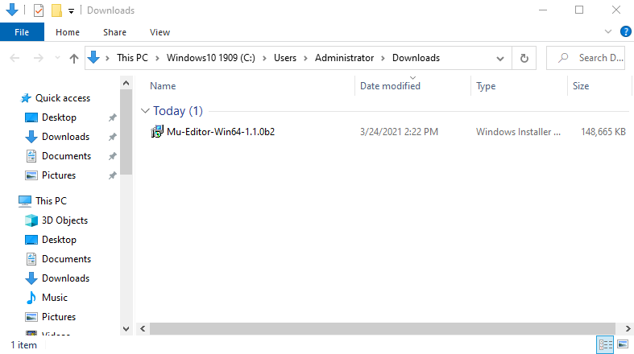
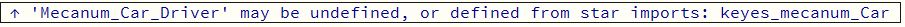
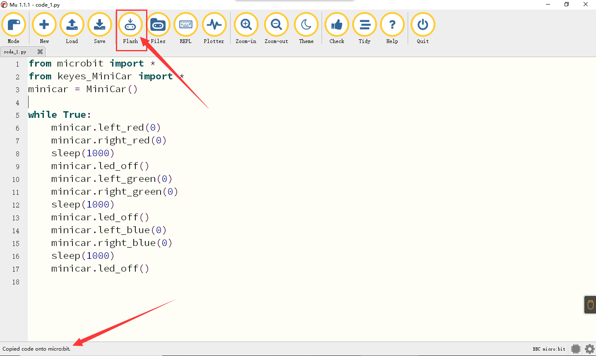
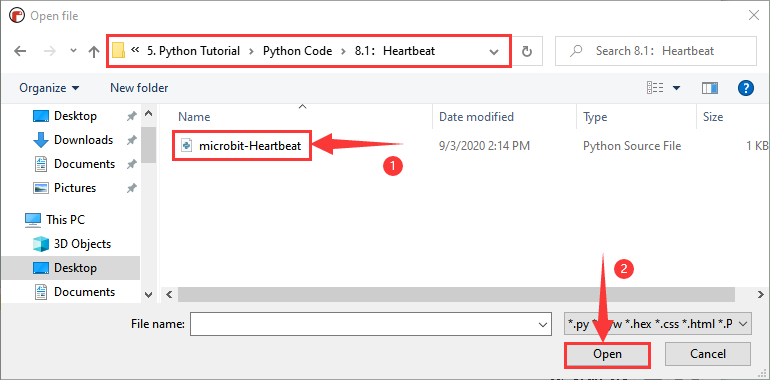
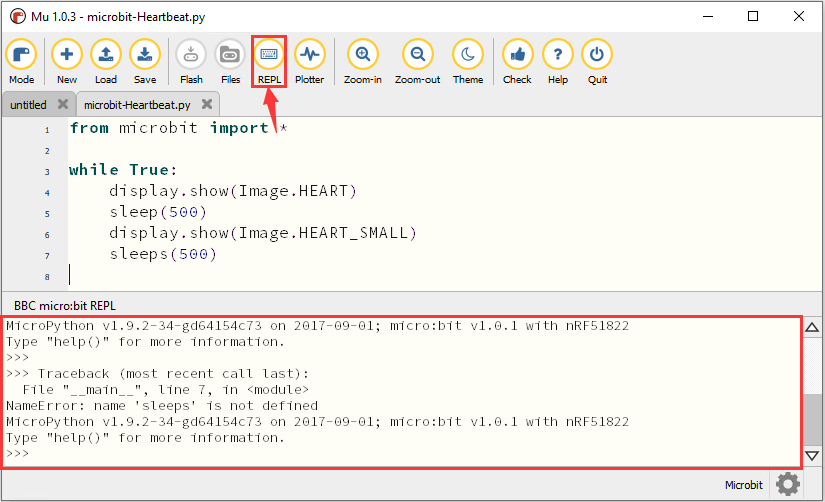
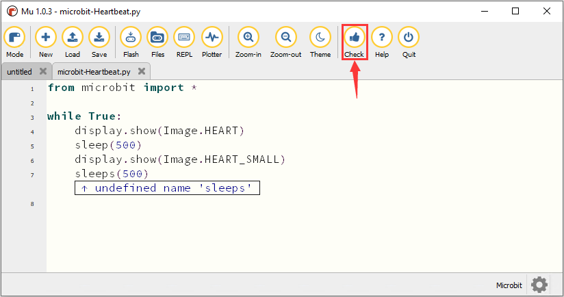
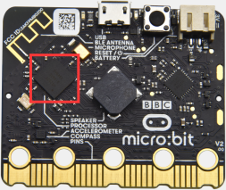
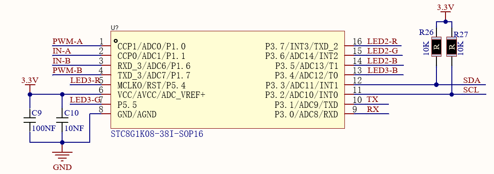
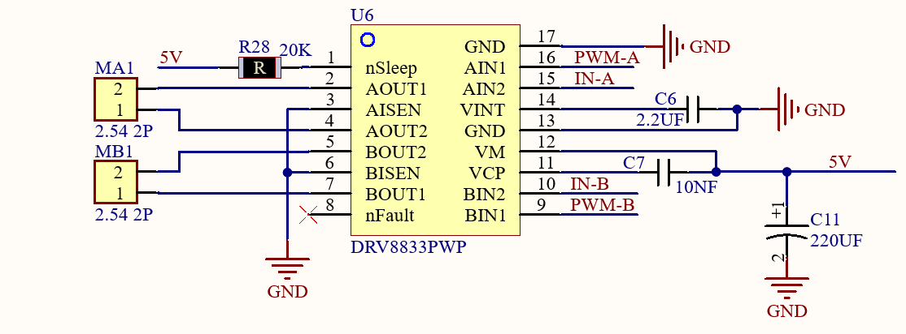

### Tutoriel Python

#### Installer un IDE

**Mu**

Le site officiel de Mu : [https://codewith.mu/](https://codewith.mu/)

Mu est un éditeur de code Python spécialement conçu pour les débutants. La façon la plus simple d’obtenir Mu est de télécharger l’installateur officiel pour Windows ou Mac OS X. La version recommandée est Mu 1.0-beta 2.

**Étape 1 - Déterminer la version et télécharger l'installateur Mu**

Vérifiez si votre ordinateur utilise Windows ou Mac OS X. Ouvrez l'Explorateur, cliquez sur "Ce PC", puis sélectionnez Propriétés pour connaître si votre système Windows est en 32 bits ou 64 bits.


Ouvrez le lien : [https://codewith.mu/en/download](https://codewith.mu/en/download) pour télécharger la version correspondante de Mu.

**Étape 2 - Exécuter l’installateur :**

Trouvez l'installateur que vous venez de télécharger (il peut se trouver dans votre dossier Téléchargements) et double-cliquez pour ouvrir le fichier installateur.


Pour Mac OS X : [https://codewith.mu/en/howto/1.1/install_macos](https://codewith.mu/en/howto/1.1/install_macos)

Pour Windows 10 :

Clicquer "pour plus d'information"


**Étape 3 - Protocole :**

Acceptez la licence, puis cliquez sur Installer.


**Étape 4 - Installation :**

L'installation de Mu sur votre ordinateur prend quelques secondes.


**Étape 5 - Terminer :**

Cliquez sur "Terminer".


**Étape 6 - Démarrer Mu :**

Vous pouvez lancer Mu en cliquant sur l'icône dans le menu Démarrer ou en tapant Mu dans la barre de recherche.


l'interface de Mu resemble à cela:


---

### Installer le pilote

Micro:bit peut être utilisé sans installer de pilote. Si votre ordinateur ne reconnaît pas la carte micro:bit, vous devrez installer le pilote micro:bit. Le fichier de pilote micro:bit et le manuel d’installation du pilote micro:bit se trouvent dans le dossier "Micro:bit Driver Download and Installation".


Installez le pilote en suivant les instructions dans le manuel d'installation de pilote dans le dossier approprié.


---

### Configuration du compilateur et introduction à la barre d'outils

**Configurer le mode en "micro:bit"**

Ouvrez Mu, cliquez sur le bouton Mode dans la barre de menu et sélectionnez "BBC micro:bit", puis cliquez sur "OK".


Détails sur l'opération Mu
Page: [https://codewith.mu/en/tutorials/1.1/start](https://codewith.mu/en/tutorials/1.1/start)

Plus d'instructions pour utiliser Mu : [https://codewith.mu/en/tutorials/](https://codewith.mu/en/tutorials/)

---

### Installer le fichier de bibliothèque

Avant d'importer la bibliothèque, vous devez télécharger un code `.py` sur le micro:bit. Par exemple, pour le module RGB, ouvrez le fichier "code_1.py" dans le didacticiel.

Importez le fichier "keyes_MiniCar.py" dans le dossier "mu_code" dans votre répertoire utilisateur. Branchez ensuite le micro:bit à votre ordinateur et cliquez sur le bouton "Fichiers" dans Mu pour faire glisser le fichier de bibliothèque "keyes_MiniCar.py" sur le micro:bit.
PAr default le répertoire de sauvegarde est "Mu_code", lequel est localisé à la racine du dossier de l'utilisateur.

Reference
links:[<u>https://codewith.mu/en/tutorials/1.0/files</u>](https://codewith.mu/en/tutorials/1.0/files)

Par exemple, dans les fenêtres, si votre système est installé sur le lecteur C de
votre ordinateur et le nom d'utilisateur est Administrateur, le chemin vers le
Le répertoire mu-code est C:\Users\Administrator\mu\_ code. Sur Linux, le
chemin est le code '~/home/mu_code'.


Cliquez sur "Vérifier" pour tester le code. Si une ligne apparaît avec un curseur ou un soulignement, cela signifie qu'il y a une erreur.
**Entrez le fichier « mu_code »**


Répliquez le fichier de bibliothèque « keyes_MiniCar.py » dans le dossier « mu_code ». Le chemin du code
est le suivant :


Ouvrez le logiciel Mu et connectez le micro:bit à votre ordinateur, puis
cliquez sur le bouton « Files » et faites glisser le fichier de bibliothèque « keyes_MiniCar.py » dans le micro:bit.
dans le micro:bit.


Une fois l'importation réussie, vous le verrez dans la boîte de gauche.


Appuyez sur « Vérifier » pour vérifier que le code ne contient pas d'erreurs. Si une ligne apparaît avec un curseur
ou un trait de soulignement, il y a une erreur dans le programme pour cette ligne.


Ces conseils ne sont que des avertissements, pas des conseils d'erreur de code.




Vous devez également vous assurer que le câble micro USB est connecté au micro:bit et à l'ordinateur.
micro:bit et à l'ordinateur, puis cliquez sur le bouton « Flash » pour télécharger le code sur le micro:bit.
télécharger le code sur le micro:bit.



En cas d'erreur après avoir cliqué sur le bouton « Flash », vérifiez que vous avez bien importé le fichier de la bibliothèque dans le micro:bit.
que vous avez bien importé le fichier de la bibliothèque vers micro:bit.

Remarque :

Si vous avez téléchargé d'autres programmes sur la carte micro:bit, à l'exception du programme
« keyes_MiniCar.py ». Avant de programmer en Micropython, vous devez
devez importer le fichier de la bibliothèque dans le micro : bit.
Si vous utilisez toujours le même micro:boardboard pour la programmation Micropython, vous n'avez pas besoin de l'envoyer au micro: bit à nouveau.

### Ajouter un code au compilateur

Nous prenons le premier projet du tutoriel de base "Heartbeat" en tant que
par exemple, ouvrir le dossier "Program" dans le premier dossier du projet et
Localiser le fichier "microbit-Heartbeat.




Ouvre le le programme Mu  et selectionne le programme "microbit-Heartbeat.py et glisse dans MU :


---

### Télécharger du code vers le Micro:bit

Connectez la carte micro:bit à l'ordinateur via le câble micro USB. Cliquez sur "Flash" pour télécharger le code sur la micro:bit.


En cas d’erreur après avoir cliqué sur "Flash", vérifiez si le fichier de bibliothèque a bien été importé dans la micro:bit. Vous pouvez vérifier le code en cliquant sur "Vérifier". Si Mu n'indique aucun problème, votre code est prêt.


Après le téléchargement, si la matrice LED affiche des messages d'erreur, appuyez sur le bouton « REPL », puis appuyez sur le bouton de réinitialisation du micro : bit.
le bouton « REPL », puis appuyez sur le bouton de réinitialisation du micro : bit (pas sur les touches A et B) et le message d'erreur s'affichera dans la fenêtre REPL.
les touches A et B) et le message d'erreur s'affichera dans la boîte REPL
comme suit :



Cliquez à nouveau sur « REPL », le mode REPL sera désactivé, et vous pourrez
rafraîchir le nouveau code. Pour vous assurer que le code est correct, appuyez sur « Check » lorsque vous avez terminé.
pour vérifier que le code ne contient pas d'erreurs, comme indiqué ci-dessous, puis Mu indiquera l'erreur dans le code.
Mu indiquera alors l'erreur dans le code.



Corrigez le code en fonction du message d'erreur. Cliquez ensuite à nouveau sur « Check » (vérifier)
et Mu n'affiche aucun problème dans la barre ci-dessous :


Pour plus de tutoriels sur l'utilisation de Mu, consultez le lien：

<https://codewith.mu/en/tutorials/>

---

## Projets de base Microbit


### Projet 1 : Battement de cœur

1. Description

Les modules de capteurs et la matrice de LED du projet de base Microbit sont fournis avec la carte micro:bit.

Préparez une carte Micro:bit et un câble USB. Ensuite, nous allons réaliser une expérience de base où un motif de battement de cœur clignote sur la carte micro:bit.

2. Composants nécessaires

|  |  |         |
|--------------------------------------------------|--------------------------------------------------|---------|
| Micro:bit * 1                                    | Câble USB * 1                                    |         |

3. Code de test

Vous pouvez télécharger le code directement depuis le tutoriel (consultez le fichier "Configuration de l'environnement de développement" en cas de doute).

**Code :**

```python
from microbit import *

while True:
    display.show(Image.HEART)
    sleep(500)
    display.show(Image.HEART_SMALL)
    sleep(500)
```

4. Explication du code

| Code                                         | Explication                                                                                           |
|----------------------------------------------|-------------------------------------------------------------------------------------------------------|
| **from** microbit **import** *               | Importe la bibliothèque de la carte micro:bit                                                         |
| **while True:**                              | C'est une boucle permanente qui fait exécuter le code dans la boucle de façon continue par la micro:bit |
| display.show(Image.HEART)                    | La matrice LED affiche le symbole du cœur grand        |
| sleep(500)                                   | Délai de 500 ms                                                                                       |
| display.show(Image.HEART_SMALL)              | La matrice LED affiche le symbole du petit cœur        |

5. Résultat du test

Téléchargez le code sur la carte micro:bit et branchez-la via un câble USB, la matrice LED affichera le grand cœur  et le petit cœur .

Si le téléchargement échoue, débranchez la carte micro:bit et redémarrez-la.


6. Connaissances supplémentaires

Vous pouvez voir que "Image.HEART" correspond au grand cœur  et "Image.HEART_SMALL" correspond au petit cœur . Cela est en fait préprogrammé dans la micro:bit, vous pouvez donc l'utiliser directement.

Voici une liste des images intégrées. Si cela vous intéresse, vous pouvez remplacer "Image.HEART" dans la fonction `show()` par une des images suivantes :

- Image.HEART
- Image.HEART_SMALL
- Image.HAPPY
- Image.SMILE
- Image.SAD
- Image.CONFUSED
- Image.ANGRY
- Image.ASLEEP
- Image.SURPRISED
- Image.SILLY
- Image.FABULOUS
- Image.MEH
- Image.YES
- Image.NO
- Image.CLOCK12, Image.CLOCK11, Image.CLOCK10, Image.CLOCK9, Image.CLOCK8, Image.CLOCK7, Image.CLOCK6, Image.CLOCK5, Image.CLOCK4, Image.CLOCK3, Image.CLOCK2, Image.CLOCK1
- Image.ARROW_N, Image.ARROW_NE, Image.ARROW_E, Image.ARROW_SE, Image.ARROW_S, Image.ARROW_SW, Image.ARROW_W, Image.ARROW_NW
- Image.TRIANGLE
- Image.TRIANGLE_LEFT
- Image.CHESSBOARD
- Image.DIAMOND
- Image.DIAMOND_SMALL
- Image.SQUARE
- Image.SQUARE_SMALL
- Image.RABBIT
- Image.COW
- Image.MUSIC_CROTCHET
- Image.MUSIC_QUAVER
- Image.MUSIC_QUAVERS
- Image.PITCHFORK
- Image.PACMAN
- Image.TARGET
- Image.TSHIRT
- Image.ROLLERSKATE
- Image.DUCK
- Image.HOUSE
- Image.TORTOISE
- Image.BUTTERFLY
- Image.STICKFIGURE
- Image.GHOST
- Image.SWORD
- Image.GIRAFFE
- Image.SKULL
- Image.UMBRELLA
- Image.SNAKE, Image.ALL_CLOCKS, Image.ALL_ARROWS

--- 


### Projet 2 : Allumer une LED unique

1. Description

La carte micro:bit comprend 25 diodes électroluminescentes (LED), regroupées en 5 lignes et 5 colonnes, formant une matrice de 5\*5. Chaque diode se situe à un point de coordonnées (x, y).

Nous pouvons contrôler une LED en définissant des points de coordonnées. Par exemple, pour allumer la LED à la ligne 1, colonne 1, on peut définir le point de coordonnées (0, 0). Pour allumer la LED à la ligne 1, colonne 3, on peut définir (2, 0), et ainsi de suite.


2. Composants nécessaires

|  |  |         |
|--------------------------------------------------|--------------------------------------------------|---------|
| Micro:bit * 1                                    | Câble USB * 1                                    |         |

3. Code de test

Vous pouvez télécharger le code directement depuis le tutoriel (consultez le fichier "Configuration de l'environnement de développement" en cas de doute).

**Code :**

```python
from microbit import *

val1 = Image("09000:""00000:""00000:""00000:""00000:")
val2 = Image("00000:""00000:""00000:""00000:""00090:")
val3 = Image("00000:""00000:""00000:""00000:""00000:")

while True:
    display.show(val1)
    sleep(500)
    display.show(val3)
    sleep(500)
    display.show(val2)
    sleep(500)
    display.show(val3)
    sleep(500)
```

4. Explication du code

| Code                                                    | Explication                                                                                                                      |
|---------------------------------------------------------|----------------------------------------------------------------------------------------------------------------------------------|
| **from** microbit **import** *                          | Importe la bibliothèque de la carte micro:bit                                                                                    |
| **val1 = Image("09000:""00000:""00000:""00000:""00000:")**<br>**val2 = Image("00000:""00000:""00000:""00000:""00090:")**<br>**val3 = Image("00000:""00000:""00000:""00000:""00000:")** | Définit `val1`, `val2`, et `val3` comme des images.<br>Chaque pixel peut être réglé de 0 (éteint) à 9 (luminosité maximale). |
| **while True:**                                         | Cette boucle permanente exécute le code en continu.                                                                              |
| **display.show(val1)**<br>**sleep(500)**<br>**display.show(val3)**<br>**sleep(500)** | La LED en (1,0) clignote pendant 0,5 seconde.                                                                                  |
| **display.show(val2)**<br>**sleep(500)**<br>**display.show(val3)**<br>**sleep(500)** | La LED en (3,4) clignote pendant 0,5 seconde.                                                                                  |

5. Résultat du test

Après avoir téléchargé le code et branché la carte avec un câble USB, vous verrez la LED en (1,0) clignoter pendant 0,5 seconde, puis la LED en (3,4) clignoter également pendant 0,5 seconde, en boucle.


---

### Projet 3 : Matrice de points LED 5 x 5

1. Description

Les matrices de points sont courantes dans notre quotidien, telles que les écrans LED, les stations de bus, et les mini télévisions dans les ascenseurs.

La matrice de points de la carte Micro:bit est composée de 25 diodes électroluminescentes (LED). Dans la leçon précédente, nous avons contrôlé les LED de la carte Micro:bit pour former des motifs, des nombres et des chaînes de caractères en définissant les points de coordonnées. Nous pouvons également utiliser une autre méthode pour afficher des motifs, des nombres et des chaînes de caractères.

2. Composants nécessaires

|  |  |         |
|--------------------------------------------------|--------------------------------------------------|---------|
| Micro:bit * 1                                    | Câble USB * 1                                    |         |

3. Code de test

**Code 1 :**

```python
from microbit import *

val = Image("00900:""00900:""90909:""09990:""00900")

display.show(val)
```

**Code 2 :**

```python
from microbit import *

val = Image("00900:""00900:""90909:""09990:""00900")

display.show('1')
sleep(500)
display.show('2')
sleep(500)
display.show('3')
sleep(500)
display.show('4')
sleep(500)
display.show('5')
sleep(500)
display.show(val)
sleep(500)
display.scroll("hello!")
sleep(200)
display.show(Image.HEART)
sleep(500)
display.show(Image.ARROW_NE)
sleep(500)
display.show(Image.ARROW_SE)
sleep(500)
display.show(Image.ARROW_SW)
sleep(500)
display.show(Image.ARROW_NW)
sleep(500)
display.clear()
```

4. Explication du code

| Code                                                                                   | Explication                                                    |
|----------------------------------------------------------------------------------------|----------------------------------------------------------------|
| **from** microbit **import** *                                                         | Importe la bibliothèque de la carte Micro:bit                  |
| **val = Image("09000:""00000:""00000:""00000:""00000:")**                              | Définit une image `val`                                        |
| **display.show(val)**                                                                  | Affiche l’image “→”                                            |
| **display.show('1')**                                                                  | Affiche “1” sur le Micro:bit                                   |
| **sleep(500)**                                                                        | Pause de 500 ms                                                |
| **display.scroll("hello!")**                                                           | Fait défiler le texte “hello!”                                 |
| **display.show(Image.HEART)**                                                          | Affiche un cœur “❤”                                            |
| **display.show(Image.ARROW_NE)**, etc.                                                 | Affiche des flèches directionnelles : nord-est, sud-est, etc.  |
| **display.clear()**                                                                    | Efface la matrice de points LED                                 |

5. Résultat du test

Téléchargez le code 2 sur la carte Micro:bit. La matrice de points LED affichera successivement “1”, “2”, “3”, “4”, “5”, “↓”, “hello!”, “❤”, , ,  et , avec un intervalle de 500 ms entre chaque affichage.

---

### Projet 4 : Boutons programmables

1. Description

Les boutons permettent de contrôler l'ouverture et la fermeture des circuits. Lorsqu'un bouton n'est pas pressé, le circuit est ouvert (interrompu). En le pressant, le circuit se ferme, mais il se rouvre dès qu'on relâche le bouton.

La carte Micro:bit dispose de trois boutons : un bouton de réinitialisation à l'arrière, et deux boutons programmables à l'avant. En appuyant sur A, B, ou A et B simultanément, l'affichage correspondant apparaît.

2. Composants nécessaires

|  |  |         |
|--------------------------------------------------|--------------------------------------------------|---------|
| Micro:bit * 1                                    | Câble USB * 1                                    |         |

3. Code de test

**Code 1 :**

```python
from microbit import *

while True:
    if button_a.is_pressed():
        display.show("A")
    elif button_a.is_pressed() and button_b.is_pressed():
        display.scroll("AB")
    elif button_b.is_pressed():
        display.show("B")
```

**Résultat du test :** Téléchargez le code 1, connectez la carte Micro:bit via un câble USB, et appuyez sur “A” pour afficher “A”. Si vous appuyez sur “B”, la lettre “B” apparaîtra. Si vous appuyez simultanément sur les boutons A et B, le message “AB” s’affichera.

**Code 2 :**

```python
from microbit import *
a = 0
b = 0
val1 = Image("00000:""00000:""00000:""00000:""00900")
val2 = Image("00000:""00000:""00000:""00900:""99999")
val3 = Image("00000:""00000:""00900:""99999:""99999")
val4 = Image("00000:""00900:""99999:""99999:""99999")
val5 = Image("00900:""99999:""99999:""99999:""99999")
val6 = Image("99999:""99999:""99999:""99999:""99999")
display.show(val1)

while True:
    while button_a.is_pressed() == True:
        sleep(10)
        if button_a.is_pressed() == False:
            a = a + 1
            if(a >= 5):
                a = 5
            break
    while button_b.is_pressed() == True:
        sleep(10)
        if button_b.is_pressed() == False:
            a = a - 1
            if(a <= 0):
                a = 0
            break
    if a == 0:
        display.show(val1)
    if a == 1:
        display.show(val2)
    if a == 2:
        display.show(val3)
    if a == 3:
        display.show(val4)
    if a == 4:
        display.show(val5)
    if a == 5:
        display.show(val6)
```

**Résultat du test :** Téléchargez le code 2 et connectez la carte via un câble USB. En appuyant sur le bouton A, le nombre de lignes éclairées par la matrice de points LED augmentera. Si vous appuyez sur le bouton B, le nombre de lignes éclairées diminuera.

4. Explication du code

| Code                                                                                             | Explication                                                                                |
|--------------------------------------------------------------------------------------------------|--------------------------------------------------------------------------------------------|
| **from** microbit **import** *                                                                   | Importe la bibliothèque de la carte Micro:bit                                              |
| **while True:**                                                                                  | Boucle permanente pour exécuter le code                                                     |
| **if button_a.is_pressed(): display.show("A")**<br>**elif button_a.is_pressed() and button_b.is_pressed(): display.scroll("AB")**<br>**elif button_b.is_pressed(): display.show("B")** | Affiche “A” si le bouton A est pressé, “AB” si les boutons A et B sont pressés, et “B” si seul le bouton B est pressé |
| **while button_a.is_pressed() == True:**<br>**sleep(10)**<br>**if button_a.is_pressed() == False:**<br>**a = a + 1**<br>**if(a >= 5): a = 5**<br>**break** | Incrémente `a` de 1 chaque fois que le bouton A est pressé. La valeur maximale de `a` est 5. |
| **while button_b.is_pressed() == True:**<br>**sleep(10)**<br>**if button_b.is_pressed() == False:**<br>**a = a - 1**<br>**if(a <= 0): a = 0**<br>**break** | Décrémente `a` de 1 chaque fois que le bouton B est pressé. La valeur minimale de `a` est 0. |
| **if a == 0: display.show(val1)**, etc.                                                         | Affiche les motifs `val1`, `val2`, etc., selon la valeur de `a`.                           |


---

### Projet 5 : Mesure de la température

1. Description

La carte principale Micro:bit n’a pas de capteur de température intégré, mais elle peut détecter la température via le capteur intégré au circuit NRF51822. Par conséquent, la température détectée est plus proche de celle du circuit.

Dans ce projet, nous allons utiliser le capteur pour tester la température de l'environnement actuel, afficher les résultats sur la carte et, en fonction de la plage de température, contrôler la matrice de points LED pour afficher différents motifs.



**(Capteur de température)**

2. Composants nécessaires

|  |  |         |
|--------------------------------------------------|--------------------------------------------------|---------|
| Micro:bit * 1                                    | Câble USB * 1                                    |         |

3. Code de test

Vous pouvez télécharger le code directement depuis le tutoriel (consultez le fichier "Configuration de l'environnement de développement" si nécessaire).

**Code 1 :**

```python
from microbit import *
while True:
    Temperature = temperature()
    print("Temperature:", Temperature, "C")
    sleep(500)
```

**Résultat du test :** Après avoir téléchargé le code de test 1 sur la carte Micro:bit, laissez-la connectée en USB, cliquez sur “REPL” et appuyez sur le bouton de réinitialisation de la Micro:bit. La fenêtre REPL affichera la température ambiante en degrés Celsius.


**Code 2 :**

```python
from microbit import *
while True:
    if temperature() >= 35:
        display.show(Image.HEART)
    else:
        display.show(Image.HEART_SMALL)
```

**Résultat du test :** Téléchargez le code 2, branchez la Micro:bit via un câble USB. Lorsque la température ambiante est inférieure à 35°C, la matrice LED affiche . Si la température est de 35°C ou plus, le motif  apparaît.

4. Explication du code

| Code                                                                                     | Explication                                                |
|------------------------------------------------------------------------------------------|------------------------------------------------------------|
| **from microbit import ***                                                               | Importe la bibliothèque de la carte Micro:bit              |
| **while True:**                                                                         | Boucle permanente pour exécuter le code                    |
| **Temperature = temperature()**                                                          | Définit `Temperature` avec la valeur renvoyée par `temperature()` |
| **print("Temperature:", Temperature, "C")**                                              | Affiche la température dans la fenêtre REPL                |
| **sleep(500)**                                                                          | Pause de 500 ms                                            |
| **if temperature() >= 35:**<br>**display.show(Image.HEART)**<br>**else:**<br>**display.show(Image.HEART_SMALL)** | Affiche un cœur grand si température ≥ 35°C, un cœur petit sinon |

---

### Projet 6 : Boussole

1. Description

Ce projet présente l'utilisation de la boussole intégrée dans la Micro:bit, qui peut être utilisée pour déterminer la direction. Lorsqu'on utilise le capteur magnétique pour la première fois, il est nécessaire de calibrer la carte Micro:bit en la faisant tourner.

En outre, des objets proches peuvent affecter la précision des lectures et de la calibration.


**(Boussole)**

2. Composants nécessaires

|  |  |         |
|--------------------------------------------------|--------------------------------------------------|---------|
| Micro:bit * 1                                    | Câble USB * 1                                    |         |

3. Code de test

Vous pouvez télécharger le code directement depuis le tutoriel.

**Code 1 :**

```python
from microbit import *
compass.calibrate()
while True:
    if button_a.is_pressed():
        display.scroll(compass.heading())
```

**Explication du code :** La calibration est nécessaire en raison des différences de champ magnétique selon les régions. Micro:bit invite à la calibration lors de la première utilisation.

Transférez le code 1 vers la Micro:bit, branchez-la via un câble USB et appuyez sur le bouton A. L'écran affichera “TILT TO FILL SCREEN”. Faites pivoter la carte jusqu'à ce qu'elle affiche un motif carré complet (les 25 LED allumées). Une fois calibrée, le symbole de sourire apparaîtra.


Le moniteur série affichera 0°, 90°, 180° et 270° en appuyant sur A.

**Code 2 :**

```python
from microbit import *
compass.calibrate()
x = 0
while True:
    x = compass.heading()
    if x >= 293 and x < 338:
        display.show(Image("00999:""00099:""00909:""09000:""90000"))
    elif x >= 23 and x < 68:
        display.show(Image("99900:""99000:""90900:""00090:""00009"))
    elif x >= 68 and x < 113:
        display.show(Image("00900:""09000:""99999:""09000:""00900"))
    elif x >= 113 and x < 158:
        display.show(Image("00009:""00090:""90900:""99000:""99900"))
    elif x >= 158 and x < 203:
        display.show(Image("00900:""00900:""90909:""09990:""00900"))
    elif x >= 203 and x < 248:
        display.show(Image("90000:""09000:""00909:""00099:""00999"))
    elif x >= 248 and x < 293:
        display.show(Image("00900:""00090:""99999:""00090:""00900"))
    else:
        display.show(Image("00900:""09990:""90909:""00900:""00900"))
```

Positionnez la carte Micro:bit vers le nord, sud, est et ouest de manière horizontale, la matrice de points LED affichera les motifs correspondants.


4. Explication du code

| Code                                                                                      | Explication                                                |
|-------------------------------------------------------------------------------------------|------------------------------------------------------------|
| **from microbit import ***                                                                | Importe la bibliothèque de la carte Micro:bit              |
| **compass.calibrate()**                                                                  | Calibration de la boussole                                 |
| **while True:**                                                                          | Boucle permanente                                          |
| **if button_a.is_pressed():**<br>**display.scroll(compass.heading())**                   | Affiche l’angle de la boussole si le bouton A est pressé   |
| **x = compass.heading()**                                                                | Définit la variable `x` avec la valeur de l’orientation    |
| **if... elif... else**                                                                   | Conditions pour afficher les motifs selon la direction     |
| **display.show(Image(...))**                                                             | Affiche les flèches indiquant les différentes directions (nord, sud, etc.) |


---

### Projet 7 : Accéléromètre

1. Description

La carte Micro:bit est équipée d'un capteur d'accélération intégré LSM303AGR (accéléromètre). Elle a une résolution de 8, 10 et 12 bits, et le programme peut définir une plage de mesure de 1g, 2g, 4g et 8g.

Nous utilisons souvent l'accéléromètre pour détecter l'attitude des machines.

Dans ce projet, nous allons détecter plusieurs postures spécifiques avec l'accéléromètre, puis examiner les données brutes de l'axe triaxial fournies par celui-ci.

2. Composants nécessaires

|  |  |         |
|--------------------------------------------------|--------------------------------------------------|---------|
| Micro:bit * 1                                    | Câble USB * 1                                    |         |

3. Code de test

Vous pouvez télécharger le code directement depuis le tutoriel (consultez le fichier "Configuration de l'environnement de développement" si nécessaire).

**Code 1 :**

```python
from microbit import *

while True:
    gesture = accelerometer.current_gesture()

    if gesture == "shake":
        display.show("1")
    if gesture == "up":
        display.show("2")
    if gesture == "down":
        display.show("3")
    if gesture == "face up":
        display.show("4")
    if gesture == "face down":
        display.show("5")
    if gesture == "left":
        display.show("6")
    if gesture == "right":
        display.show("7")
    if gesture == "freefall":
        display.show("8")
```

**Résultat du test :** Téléchargez le code 1 sur la carte Micro:bit et branchez-la avec un câble USB, puis secouez la carte Micro:bit, le chiffre 1 apparaîtra. En plaçant le logo vers le haut, le chiffre 2 s'affichera :


Lorsque le logo est vers le bas, le chiffre 3 s'affiche :


Lorsque l'écran est orienté vers le haut, le chiffre 4 est affiché.


Inversement, le chiffre 5 s'affiche lorsque l'écran est orienté vers le bas.

Lorsque la carte Micro:bit est inclinée vers la gauche, le chiffre 6 s'affiche :


Lorsque la carte Micro:bit est inclinée vers la droite, le chiffre 7 s'affiche :


En cas de chute libre, le chiffre 8 apparaîtra sur la matrice de points (Remarque : nous ne recommandons pas de laisser tomber la carte pour éviter des dommages).

**Code 2 :**

```python
from microbit import *
while True:

    x = accelerometer.get_x()
    y = accelerometer.get_y()
    z = accelerometer.get_z()
    print("x, y, z:", x, y, z)
    sleep(100)
```

**Résultat du test :** Téléchargez le code 2 sur la carte Micro:bit et branchez-la avec un câble USB, cliquez sur “REPL” et appuyez sur le bouton de réinitialisation de la Micro:bit. La fenêtre REPL affichera les valeurs d'accélération de la carte Micro:bit le long des axes X, Y et Z, comme ci-dessous :


4. Explication du code

| Code                                                                                     | Explication                                                                                   |
|------------------------------------------------------------------------------------------|-----------------------------------------------------------------------------------------------|
| **from microbit import ***                                                               | Importe la bibliothèque de la carte Micro:bit                                                 |
| **gesture = accelerometer.current_gesture()**                                            | Définit `gesture` avec la posture actuelle de l'accéléromètre                                 |
| **while True:**                                                                          | Boucle permanente pour exécuter le code                                                       |
| **if gesture == "shake":**<br>**display.show("1")**<br>*(etc.)*                          | Affiche un chiffre en fonction de la posture détectée (ex. 1 pour secouer, 2 pour "haut")    |
| **x = accelerometer.get_x()**<br>**y = accelerometer.get_y()**<br>**z = accelerometer.get_z()** | Lit les valeurs d'accélération sur les axes X, Y et Z                                         |
| **print("x, y, z:", x, y, z)**                                                           | Affiche les valeurs d'accélération dans REPL                                                  |
| **sleep(100)**                                                                           | Pause de 100 ms                                                                               |

---

### Projet 8 : Détection de l'intensité lumineuse

1. Description

Ce projet explique comment la Micro:bit détecte l'intensité lumineuse externe. Comme la Micro:bit ne possède pas de capteur photosensible, la détection de la lumière se fait par la matrice LED. La matrice LED est utilisée pour capter la lumière ambiante en convertissant les LEDs en entrée et en échantillonnant le temps de dégradation de la tension. L'intensité lumineuse détectée est une valeur relative.


**(Zone de détection de l'intensité lumineuse)**

2. Composants nécessaires

|  |  |         |
|--------------------------------------------------|--------------------------------------------------|---------|
| Micro:bit * 1                                    | Câble USB * 1                                    |         |

3. Code de test

Vous pouvez télécharger le code directement depuis le tutoriel.

```python
from microbit import *

while True:
    Lightintensity = display.read_light_level()
    print("Light intensity:", Lightintensity)
    sleep(100)
```

4. Explication du code

| Code                                            | Explication                                                  |
|-------------------------------------------------|--------------------------------------------------------------|
| **from microbit import ***                      | Importe la bibliothèque de la carte Micro:bit                |
| **while True:**                                 | Boucle permanente pour exécuter le code                      |
| **Lightintensity = display.read_light_level()** | Lit l'intensité lumineuse détectée par la matrice LED        |
| **print("Light intensity:", Lightintensity)**   | Affiche l'intensité lumineuse dans REPL                      |
| **sleep(100)**                                  | Pause de 100 ms                                              |

5. Résultat du test

Téléchargez le code sur la carte Micro:bit et laissez le câble USB branché. Cliquez sur “REPL” et appuyez sur le bouton de réinitialisation, la valeur de l'intensité lumineuse sera affichée. En couvrant la matrice LED, la valeur sera proche de 0 ; à l'inverse, l'intensité augmente en plaçant la carte Micro:bit sous une source de lumière.


---

### Projet 9 : Haut-parleur

1. **Description**

La carte Micro:bit dispose d'un haut-parleur intégré, ce qui facilite l'ajout de sons à vos projets. Le haut-parleur peut être programmé pour émettre divers sons, par exemple pour jouer un morceau de musique comme "L'Ode à la Joie".


**(Haut-parleur)**

2. **Composants nécessaires**

|  |  |         |
|--------------------------------------------------|--------------------------------------------------|---------|
| Micro:bit * 1                                    | Câble USB * 1                                    |         |

3. **Code de test**

Vous pouvez télécharger le code directement depuis le tutoriel (voir le fichier "Configuration de l'environnement de développement" si besoin).

```python
from microbit import *
import audio

display.show(Image.MUSIC_QUAVER)

while True:
    audio.play(Sound.GIGGLE)
    sleep(1000)
    audio.play(Sound.HAPPY)
    sleep(1000)
    audio.play(Sound.HELLO)
    sleep(1000)
    audio.play(Sound.YAWN)
    sleep(1000)
```

4. **Explication du code**

| Code                                  | Explication                                          |
|---------------------------------------|------------------------------------------------------|
| `from microbit import *`               | Importe la bibliothèque Micro:bit                    |
| `import audio`                         | Importe la bibliothèque audio                        |
| `display.show(Image.MUSIC_QUAVER)`     | Affiche l'icône de note de musique sur l'affichage   |
| **while True:**                        | Boucle infinie qui fait exécuter le code en continu  |
| `audio.play(Sound.GIGGLE)`             | Émet un son de rire                                  |
| `sleep(1000)`                          | Pause de 1000 ms                                     |
| `audio.play(Sound.HAPPY)`              | Émet un son joyeux                                   |
| `audio.play(Sound.HELLO)`              | Émet un son de salutation                            |
| `audio.play(Sound.YAWN)`               | Émet un son de bâillement                             |

5. **Résultat du test**

Téléchargez le code sur la carte Micro:bit, et laissez le câble USB branché. Le haut-parleur émettra une séquence de sons et la matrice LED affichera une note de musique.


---

### Projet 10 : Logo tactile

1. **Description**

Si vous avez une carte Micro:bit, vous pouvez utiliser le logo doré, qui est sensible au toucher, comme un autre type d'entrée dans votre projet, similaire à un bouton supplémentaire. Il fonctionne comme un capteur tactile capacitif, détectant de petites variations de champs électriques lorsque vous le touchez avec votre doigt. En touchant ce logo, vous pouvez contrôler la carte Micro:bit pour qu'elle effectue certaines actions.


**(Zone tactile)**

2. **Composants nécessaires**

|  |  |         |
|--------------------------------------------------|--------------------------------------------------|---------|
| Micro:bit * 1                                    | Câble USB * 1                                    |         |

3. **Code de test**

Vous pouvez télécharger le code directement depuis le tutoriel (voir le fichier "Configuration de l'environnement de développement" si besoin).

```python
from microbit import *
time = 0
start = 0
running = False

while True:
    if button_a.was_pressed():
        running = True
        start = running_time()
    if button_b.was_pressed():
        if running:
            time += running_time() - start
        running = False
    if pin_logo.is_touched():
        if not running:
            display.scroll(int(time/1000))

    if running:
        display.show(Image.HEART)
        sleep(300)
        display.show(Image.HEART_SMALL)
        sleep(300)
    else:
        display.show(Image.ASLEEP)
```

4. **Explication du code**

1. **Temps d'exécution** : La Micro:bit enregistre le temps en millisecondes depuis son démarrage, appelé le temps d'exécution.
   
2. **Démarrage du chronomètre** : Lorsque vous appuyez sur le bouton A, une variable appelée `start` est définie pour enregistrer le temps actuel.

3. **Arrêt du chronomètre** : En appuyant sur le bouton B, la Micro:bit calcule le temps écoulé depuis le démarrage en soustrayant `start` du temps actuel, et ce temps est ajouté à une variable `time` qui stocke le temps total écoulé.

4. **Afficher le temps** : Si vous appuyez sur le logo doré, le programme affiche le temps total écoulé sur l'affichage LED, en convertissant le temps de millisecondes en secondes en divisant par 1000.

5. **Variable de contrôle `running`** : Une variable booléenne `running` contrôle l'état du chronomètre. Si `running` est vrai, le chronomètre est en marche, sinon il est arrêté.

6. **Animation de cœur battant** : Si `running` est vrai, la Micro:bit affiche un cœur battant sur l'écran LED.

7. **Affichage du temps arrêté** : Lorsque le chronomètre est arrêté (`running` est faux), le temps s'affiche uniquement si vous appuyez sur le logo doré.

8. **Prévention des fausses lectures** : Le code empêche des erreurs en s'assurant que la variable `time` n'est mise à jour que lorsque le bouton B est pressé.

5. **Résultat du test**

Téléchargez le code et branchez la Micro:bit via un câble USB. Appuyez sur le bouton A pour démarrer le chronomètre, l'écran LED affichera un cœur battant pendant le chronométrage. Appuyez sur le bouton B pour arrêter le chronomètre. En touchant le logo doré, le temps écoulé en secondes sera affiché. Pour réinitialiser le chronomètre à zéro, appuyez sur le bouton de réinitialisation à l'arrière de la carte Micro:bit.


---

### Projet 11 : Microphone

1. **Description**

La carte Micro:bit est équipée d'un microphone intégré, ce qui permet de mesurer le niveau sonore ambiant. Par exemple, lorsque vous applaudissez, le voyant LED sur la carte Micro:bit s'allume. Ce microphone peut donc détecter l'intensité sonore, ce qui vous permet de créer un visualiseur de niveau sonore ou des effets lumineux synchronisés avec la musique.


**(Trou d’entrée du microphone) (Microphone)**

2. **Composants nécessaires**

|  |  |         |
|--------------------------------------------------|--------------------------------------------------|---------|
| Micro:bit * 1                                    | Câble USB * 1                                    |         |

3. **Code de test**

Vous pouvez télécharger le code directement depuis le tutoriel (consultez le fichier "Configuration de l'environnement de développement" en cas de doute).

**Code 1 :**

```python
from microbit import *

while True:
    if microphone.current_event() == SoundEvent.LOUD:
        display.show(Image.HEART)
        sleep(200)
    if microphone.current_event() == SoundEvent.QUIET:
        display.show(Image.HEART_SMALL)
```

**Résultat du test :** Téléchargez le code 1 sur la carte Micro:bit et laissez le câble USB branché. Lorsque vous applaudissez, le cœur  s'affiche sur la matrice LED. Quand l’environnement est silencieux, un petit cœur  apparaît.

**Code 2 :**

```python
from microbit import *
maxSound = 0
lights = Image("11111:"
               "11111:"
               "11111:"
               "11111:"
               "11111")
# Ignorer la première lecture du niveau sonore
soundLevel = microphone.sound_level()
sleep(200)

while True:
    if button_a.is_pressed():
        display.scroll(maxSound)
    else:
        soundLevel = microphone.sound_level()
        display.show(lights * soundLevel)
        if soundLevel > maxSound:
            maxSound = soundLevel
```

**Résultat du test :** Téléchargez le code 2 sur la carte Micro:bit et laissez le câble USB branché. Lorsque vous appuyez sur le bouton A, la matrice LED affiche le niveau sonore maximum détecté dans l’environnement. (Remarque : pour réinitialiser la valeur maximale, appuyez sur le bouton de réinitialisation à l’arrière de la Micro:bit). En applaudissant, plus le son est fort, plus les 25 LEDs deviennent brillantes.

4. **Explication du code**

| Commande                                         | Explication |
|--------------------------------------------------|-------------|
| `from microbit import *`                         | Importe la bibliothèque Micro:bit. |
| `while True:`                                    | Crée une boucle permanente pour que la Micro:bit exécute le code en continu. |
| `if microphone.current_event() == SoundEvent.LOUD:`<br>`display.show(Image.HEART)`<br>`sleep(200)`<br>`if microphone.current_event() == SoundEvent.QUIET:`<br>`display.show(Image.HEART_SMALL)` | Si le microphone détecte un son fort, la matrice LED affiche un grand cœur ❤ pendant 200 ms. Si le son diminue, un petit cœur apparaît. |
| `maxSound = 0`                                   | Initialise `maxSound` à 0 pour enregistrer le niveau sonore maximum. |
| `lights = Image("11111:""11111:""11111:""11111:""11111")` | Crée une image d'intensité lumineuse maximale pour `lights`. |
| `soundLevel = microphone.sound_level()`          | Lit le niveau sonore actuel du microphone et le stocke dans `soundLevel`. |
| `if button_a.is_pressed(): display.scroll(maxSound)` | Si le bouton A est pressé, la matrice LED affiche la valeur maximale du niveau sonore enregistré. |
| `else: soundLevel = microphone.sound_level()`<br>`display.show(lights * soundLevel)` | Sinon, la carte ajuste la luminosité des LEDs en fonction de l'intensité sonore actuelle. |


---

### Projet 12 : Communication sans fil Bluetooth

1. **Description**

La carte Micro:bit est équipée d'un module Bluetooth à faible consommation d'énergie, permettant de se connecter à des appareils Bluetooth et d'envoyer des données. Cependant, avec seulement 16 kB de RAM, le service Bluetooth utilise 12 kB, ce qui signifie qu'il n'y a pas assez d'espace pour exécuter MicroPython en même temps que le Bluetooth. Par conséquent, seul MicroPython ou le service Bluetooth peut fonctionner à un moment donné.

Pour plus de détails sur la configuration Bluetooth en MicroPython, consultez [la documentation officielle](https://microbit-micropython.readthedocs.io/en/latest/ble.html).

Les projets précédents utilisaient les modules intégrés de la Micro:bit, comme le microphone ou la matrice LED. Cependant, les projets suivants sont des expérimentations étendues utilisant des modules supplémentaires (comme un capteur infrarouge, un capteur à ultrasons, un servo-moteur, des LED WS2812 RGB et des LED multicolores).

> **Remarque :** Débranchez le câble USB de la Micro:bit et éteignez la carte d'extension (faites basculer l’interrupteur sur « OFF ») avant de connecter la Micro:bit sur la carte d'extension pour éviter tout risque de court-circuit. Suivez la même procédure pour retirer la Micro:bit de la carte d'extension.


---

### Projet 13 : Module RGB

1. **Description**

Le mode couleur RGB (Rouge, Vert, Bleu) est une norme de couleur dans l'industrie. En ajustant les trois canaux de couleur - Rouge (R), Vert (G) et Bleu (B) - on obtient une large gamme de couleurs par intégration. Les écrans d'ordinateur utilisent ce mode de couleur pour afficher les différentes nuances de couleur.


Le mélange des couleurs RGB peut être comparé à l'éclairage de trois lampes : rouge, verte et bleue. Lorsque les lumières sont superposées, elles créent des couleurs mixtes. Plus l’intensité de chaque couleur est élevée, plus la luminosité augmente.

| Couleur      | Valeur RGB (R, G, B) | Couleur   | Valeur RGB (R, G, B) |
|--------------|-----------------------|-----------|-----------------------|
| Noir         | 255, 255, 255         | Rouge     | 0, 255, 255          |
| Vert         | 255, 0, 255           | Bleu      | 255, 255, 0          |
| Cyan         | 255, 0, 0             | Rouge foncé | 0, 255, 0          |
| Jaune        | 0, 0, 255             | Blanc     | 0, 0, 0              |

Dans ce projet, vous réaliserez deux expériences : faire briller deux LED RGB en rouge, vert et bleu, puis les faire changer progressivement de couleur.

2. **Préparation**

   1. Insérez la Micro:bit correctement dans la carte d'extension.
   2. Connectez le support de piles à la carte d'extension.
   3. Allumez l’interrupteur d’alimentation (faites glisser l’interrupteur POWER sur ON).
   4. Connectez la Micro:bit à l’ordinateur via un câble USB.
   5. Ouvrez la version Web de Makecode.

> **Note :** Pour ajouter la bibliothèque de la Mini Voiture, reportez-vous au fichier « Configuration de l’environnement de développement ».

3. **Schéma de connexion**




**Principe de fonctionnement** : La Micro:bit envoie des instructions au microcontrôleur STC8G1K08 via l'IIC. Celui-ci produit un signal PWM pour contrôler les LED RGB. Cela permet d'économiser les ports d’E/S de la Micro:bit.

4. **Explication du code**

Fonctions des LED RGB dans le fichier `Keyes_MiniCar.py` :

- `Left.red(0-255)`: Définit le rouge de la LED RGB gauche. 0 est le plus brillant, 255 est le plus sombre.
- `Left.green(0-255)`: Définit le vert de la LED RGB gauche.
- `Left.blue(0-255)`: Définit le bleu de la LED RGB gauche.
- `Right.red(0-255)`: Définit le rouge de la LED RGB droite.
- `Right.green(0-255)`: Définit le vert de la LED RGB droite.
- `Right.blue(0-255)`: Définit le bleu de la LED RGB droite.

5. **Code de Test**

Vous pouvez télécharger directement le fichier “**code_1.py**” depuis le tutoriel.

**Code 1 :**

```python
from microbit import *
from keyes_MiniCar import *
minicar = MiniCar()

while True:
    minicar.left_red(0)
    minicar.right_red(0)
    sleep(1000)
    minicar.led_off()
    minicar.left_green(0)
    minicar.right_green(0)
    sleep(1000)
    minicar.led_off()
    minicar.left_blue(0)
    minicar.right_blue(0)
    sleep(1000)
    minicar.led_off()
```

**Résultat du test :** Après avoir téléchargé le code, les LED RGB changent de couleur toutes les secondes dans l'ordre rouge, vert, bleu.

**Code 2 :**

```python
from microbit import *
from keyes_MiniCar import *
minicar = MiniCar()

while True:
    for num in range(0 , 255):
        num += 1
        minicar.left_red(255 - num)
        minicar.right_red(255 - num)
        sleep(10)

    for num in range(0 , 255):
        num += 1
        minicar.left_green(255 - num)
        minicar.right_green(255 - num)
        sleep(10)

    for num in range(0 , 255):
        num += 1
        minicar.left_red(num)
        minicar.right_red(num)
        sleep(10)

    for num in range(0 , 255):
        num += 1
        minicar.left_blue(255 - num)
        minicar.right_blue(255 - num)
        sleep(10)
```

**Résultat du test :** Après avoir téléchargé le code, les LED passent du rouge au vert, puis au bleu, en dégradé progressif.
Lorsque le re-droit est éteint, la lumière bleue s'allumera, puis un mélange de bleu un vert sera affiché.

Cependant, lorsque le feu vert est éteint, la lumière rouge sera allumée, puis l'ixème de bleu et de rouge sera montré. Pour fermer les verts rouge et bleus seront éteints.

**Connaissances élargies**

1s x 1000ms; 1ms x 1000us;1us x 1000 nm

Alors les 1000 ms que nous avons utilisés dans le projet sont de 1 s


Peut-être êtes-vous capable de configurer la couleur de lumière que vous voulez nous-mêmes. Il suffit de configurer le RVB rouge, vert et bleu PWM  RGB.

---

### Projet 14 : Contrôle des Moteurs

1. **Description**

La voiture robot est équipée de deux moteurs à courant continu (CC) avec réducteur de vitesse, qui augmentent le couple tout en réduisant la vitesse. En outre, les différents ratios de réduction permettent d’atteindre des vitesses et des couples variés.

Elle utilise également les puces STC8G1K08 et HR8833MTE. Pour économiser les ports E/S, la Micro:bit envoie des instructions au STC8G1K08 via l'IIC. Le STC8G1K08 contrôle ensuite la HR8833MTE pour gérer la direction et la vitesse des deux moteurs CC, comme illustré ci-dessous.


2. **Préparation**

   1. Insérez la Micro:bit correctement dans la carte d'extension.
   2. Connectez le support de piles à la carte d'extension.
   3. Allumez l’interrupteur d’alimentation (faites glisser l’interrupteur POWER sur ON).
   4. Connectez la Micro:bit à l’ordinateur via un câble USB.
   5. Ouvrez la version Web de Makecode.

> **Note :** Pour ajouter la bibliothèque de la Mini Voiture, reportez-vous au fichier « Configuration de l’environnement de développement ».

3. **Schéma de Connexion**




4. **Explication du Code**

Fonctions du fichier `Keyes_MiniCar.py` :

- `Motor_L(1, 70)`: Les roues gauches avancent à une vitesse PWM de 70.
- `Motor_L(0, 70)`: Les roues gauches reculent à une vitesse PWM de 70.
- `Motor_R(1, 70)`: Les roues droites avancent à une vitesse PWM de 70.
- `Motor_R(0, 70)`: Les roues droites reculent à une vitesse PWM de 70.
- `Motor_stop()`: Arrête la voiture.

5. **Code de Test**

Vous pouvez télécharger directement le fichier **motor.py** depuis le tutoriel.

**Code :**

```python
from microbit import *
from keyes_MiniCar import *
minicar = MiniCar()

while True:
    # Avancer
    minicar.Motor_L(1, 70)
    minicar.Motor_R(1, 70)
    sleep(1000)
    # Reculer
    minicar.Motor_L(0, 70)
    minicar.Motor_R(0, 70)
    sleep(1000)
    # Tourner à gauche
    minicar.Motor_L(0, 70)
    minicar.Motor_R(1, 70)
    sleep(1000)
    # Tourner à droite
    minicar.Motor_L(1, 70)
    minicar.Motor_R(0, 70)
    sleep(1000)
    # Arrêt
    minicar.Motor_stop()
    sleep(1000)
```

6. **Résultat du Test**

Téléchargez le code sur la carte Micro:bit et allumez l’interrupteur situé à l’arrière de la voiture. La voiture avancera pendant 1 seconde, reculera pendant 1 seconde, tournera à gauche pendant 1 seconde, tournera à droite pendant 1 seconde, puis s'arrêtera pendant 1 seconde.

7. **Connaissances Supplémentaires**

**Comment faire tourner le moteur à gauche ?**

1. Réglez le moteur A sur marche arrière et le moteur B sur marche avant pour un virage au centre de la distance entre les deux roues.
2. Réglez le moteur A sur arrêt et le moteur B sur marche avant pour un virage au centre de la roue gauche.
3. Faites avancer les deux moteurs, mais avec une vitesse inférieure sur la roue gauche pour que la voiture dévie vers la gauche.
4. En marche arrière, ajustez la vitesse des roues pour obtenir un virage similaire.

**Principe pour tourner à droite** : il suffit de permuter les moteurs dans les étapes ci-dessus.

---

### Projet 15 : Voiture Suiveuse de Lumière

1. **Description**

Avez-vous remarqué que les lampadaires s’allument lorsqu’il fait nuit et s’éteignent à l’aube ? Dans ce projet, nous allons découvrir le composant qui rend cela possible : la photo-résistance.

**Principe de Fonctionnement :** Il s'agit d'une résistance sensible à la lumière ambiante. Lorsque l'intensité lumineuse augmente, la résistance diminue, et le voltage du port analogique augmente, ce qui se traduit par une augmentation de la valeur analogique. Inversement, lorsque l'intensité lumineuse diminue, la résistance augmente, et le voltage du port analogique diminue. Cela nous permet de détecter l’intensité lumineuse environnante.

La photo-résistance est couramment utilisée pour mesurer, contrôler, et convertir la lumière, notamment dans les circuits de contrôle de lumière.

Dans ce projet, nous allons utiliser deux photo-résistances (gauche et droite) pour contrôler la voiture afin qu’elle suive une source de lumière.

2. **Préparation**

   1. Insérez correctement la Micro:bit dans la carte d'extension.
   2. Connectez le support de piles à la carte d'extension.
   3. Allumez l’interrupteur d’alimentation (faites glisser l’interrupteur POWER sur ON).
   4. Connectez la Micro:bit à l’ordinateur via un câble USB.
   5. Ouvrez la version Web de Makecode.

> **Note :** Pour ajouter la bibliothèque de la Mini Voiture, reportez-vous au fichier « Configuration de l’environnement de développement ».

3. **Schéma de Connexion**


4. **Lecture de la Photo-résistance**

Vous pouvez télécharger le fichier **code_1.py** directement depuis le tutoriel.

**Code 1：**

```python
from microbit import *

while True:
    LDR_L = pin1.read_analog()
    LDR_R = pin0.read_analog()
    print("LDR_L:", LDR_L)
    print("LDR_R:", LDR_R)
    sleep(1000)
```

**Résultat du Test :** Téléchargez le code 1 sur la Micro:bit, laissez le câble USB branché, puis cliquez sur “REPL” et appuyez sur le bouton de réinitialisation. La fenêtre REPL de la BBC Micro:bit affichera l’intensité lumineuse ambiante détectée par les photo-résistances sur la carte d'extension. Lorsque la lumière extérieure augmente, la valeur analogique augmente également. À l'inverse, elle diminue lorsque l’intensité de la lumière diminue.


5. **Organigramme**


6. **Voiture Suiveuse de Lumière**

Vous pouvez télécharger le fichier **code_2.py** directement depuis le tutoriel.

**Code 2：**

```python
from microbit import *
from keyes_MiniCar import *
minicar = MiniCar()

while True:
    LDR_L = pin1.read_analog()
    LDR_R = pin0.read_analog()
    if LDR_L > 650 and LDR_R > 650:
        minicar.Motor_L(1, 70)
        minicar.Motor_R(1, 70)
    elif LDR_L > 650 and LDR_R <= 650:
        minicar.Motor_L(0, 70)
        minicar.Motor_R(1, 70)
    elif LDR_L <= 650 and LDR_R > 650:
        minicar.Motor_L(1, 70)
        minicar.Motor_R(0, 70)
    else:
        minicar.Motor_stop()
```

7. **Résultat du Test**

Après avoir téléchargé le code, allumez l’interrupteur à l’arrière de la voiture, puis utilisez une lampe de poche pour diriger la voiture. Elle se déplacera vers la source de lumière, et il est préférable d'effectuer ce test dans un environnement sombre. Lorsque l’intensité lumineuse ambiante dépasse 650, la voiture avancera.

---

### Projet 16 : Voiture Suiveuse de Ligne

1. **Description**

La voiture est équipée de deux capteurs de suivi de ligne et de deux potentiomètres. Elle utilise un tube infrarouge TCRT5000, qui contient un émetteur et un récepteur infrarouge. Lorsque le récepteur reçoit les signaux infrarouges de l'émetteur par réflexion, sa résistance change, ce qui se traduit par un changement de tension sur le circuit.

La résistance varie en fonction de l'intensité du signal infrarouge reçu par le récepteur, souvent influencée par la couleur de la surface réfléchissante et sa distance par rapport au récepteur.

**Principe de Fonctionnement :** Lorsque la voiture passe sur une route blanche, le tube émetteur infrarouge situé sous la voiture émet des signaux pour détecter la route, et le récepteur capte ces signaux réfléchis, provoquant une sortie de niveau bas (0). Lorsqu’elle détecte une ligne noire, elle émet un niveau haut (1).

Le signal détecté est envoyé au port I/O du microcontrôleur. Un niveau haut (1) indique que la voiture est sur la ligne noire, tandis qu'un niveau bas (0) indique qu’elle est sur une surface blanche.

Les deux capteurs de suivi de ligne sur la carte d’extension sont contrôlés par les ports P12 et P13 de la carte micro:bit. Le capteur gauche est relié à P13 et le capteur droit à P12. Ajustez les capteurs de suivi de ligne en plaçant la voiture sur une surface noire, puis ajustez les potentiomètres pour que les LED (D3, D2) s'allument, et continuez les réglages jusqu'à ce qu’elles s'éteignent.

2. **Préparation**

   1. Insérez correctement la Micro:bit dans la carte d'extension.
   2. Connectez le support de piles à la carte d'extension.
   3. Allumez l’interrupteur d’alimentation (faites glisser l’interrupteur POWER sur ON).
   4. Connectez la Micro:bit à l’ordinateur via un câble USB.
   5. Ouvrez la version Web de Makecode.

> **Note :** Pour ajouter la bibliothèque de la Mini Voiture, reportez-vous au fichier « Configuration de l’environnement de développement ».

3. **Schéma de Connexion**


4. **Lecture des Capteurs de Suivi de Ligne**

Vous pouvez télécharger le fichier **code_1.py** directement depuis le tutoriel.

**Code 1：**

```python
from microbit import *
pin12.set_pull(pin12.PULL_UP)
pin13.set_pull(pin13.PULL_UP)
sensor_L = 0
sensor_R = 0

while True:
    sensor_L = pin13.read_digital()
    sensor_R = pin12.read_digital()
    print("sensor_L:", sensor_L)
    print("sensor_R:", sensor_R)
    sleep(1000)
```

**Résultat du Test :** Téléchargez le code 1 sur la Micro:bit et laissez le câble USB branché. Cliquez sur "REPL" et appuyez sur le bouton de réinitialisation. Les lectures des capteurs de suivi de ligne s'afficheront sur le moniteur.

Lorsque le capteur de suivi de ligne détecte un objet blanc, la valeur affichée est 0 et les LED D2 et D3 s'allument. Lorsqu'il détecte uniquement un objet noir, la valeur affichée est 1 et les LED D2 et D3 s'éteignent, comme illustré ci-dessous.


5. **Organigramme**


6. **Code de Test**

Vous pouvez télécharger le fichier **code_2.py** directement depuis le tutoriel.

**Code 2 :**

```python
from microbit import *
from keyes_MiniCar import *
minicar = MiniCar()
pin12.set_pull(pin12.PULL_UP)
pin13.set_pull(pin13.PULL_UP)
sensor_L = 0
sensor_R = 0

while True:
    sensor_L = pin13.read_digital()
    sensor_R = pin12.read_digital()
    print("sensor_L:", sensor_L)
    print("sensor_R:", sensor_R)
    if sensor_L == 1 and sensor_R == 1:
        minicar.Motor_L(1, 100)
        minicar.Motor_R(1, 100)
    elif sensor_L == 0 and sensor_R == 1:
        minicar.Motor_L(1, 100)
        minicar.Motor_R(0, 100)
    elif sensor_L == 1 and sensor_R == 0:
        minicar.Motor_L(0, 100)
        minicar.Motor_R(1, 100)
    else:
        minicar.Motor_stop()
```

7. **Résultat du Test**

Téléchargez le code 2, puis activez l'interrupteur d'alimentation sur la voiture. Placez la voiture sur une feuille avec une ligne de suivi noire. La voiture suivra cette ligne noire.

---

### Projet 17 : Suivi Ultrasonique et Évitement d'Obstacles

1. **Description**

Le capteur ultrasonique utilise le sonar pour mesurer la distance d’un objet, comme le font les chauves-souris. Il émet des ondes ultrasoniques après avoir reçu un signal de déclenchement. Lorsque ces ondes rencontrent un objet et sont réfléchies, le module envoie un signal d’écho, ce qui permet de déterminer la distance à l'objet en fonction du délai entre l’émission du signal de déclenchement et la réception de l’écho.

Sur la photo ci-dessous, le capteur ressemble à deux yeux. L’un est l’émetteur, l’autre est le récepteur.

Dans ce projet, nous apprendrons à utiliser la détection de distance par ultrasons, le suivi ultrasonique et l'évitement d’obstacles.


2. **Spécifications**

- Tension de fonctionnement : DC 3,3V-5V
- Courant de fonctionnement : 50mA－100mA, généralement 65mA
- Puissance maximale : 0,5W
- Distance de détection maximale : 3m
- Angle de détection : moins de 15 degrés
- Interface : interface 4 broches avec un espacement de 2,54 mm
- Zone de détection : moins de 4 cm (angle mort)
- Diamètre du trou de positionnement : 3 mm
- Température de fonctionnement : -10℃ à +60℃
- Dimensions : 49 mm × 22 mm × 19 mm
- Caractéristiques de protection environnementale : ROHS

3. **Principe de Fonctionnement**


1. Abaissez le signal TRIG, puis déclenchez un signal de haut niveau pendant au moins 10 µs.
2. Après le déclenchement, le module envoie automatiquement huit impulsions ultrasoniques de 40 kHz et détecte si un signal est renvoyé.
3. S’il y a un retour de signal, lorsque ECHO émet un signal de haut niveau, la durée de ce signal correspond au temps écoulé entre l’émission et la réception des ondes ultrasoniques. La distance est ensuite calculée avec la formule : distance = durée du niveau haut \* 340 m/s \* 0,5.

4. **Préparation**

   1. Insérez correctement la Micro:bit dans la carte d'extension.
   2. Connectez le support de piles à la carte d'extension.
   3. Allumez l’interrupteur d’alimentation (faites glisser l’interrupteur POWER sur ON).
   4. Connectez la Micro:bit à l’ordinateur via un câble USB.
   5. Ouvrez la version Web de Makecode.
   6. Installez le capteur ultrasonique sur la carte d'extension.

> **Note :** Pour ajouter la bibliothèque de la Mini Voiture, reportez-vous au fichier « Configuration de l’environnement de développement ».

5. **Code pour la Détection de Distance par Ultrasons**

Téléchargez le fichier **code-1.py** directement depuis le tutoriel.

**Code 1 :**

```python
from microbit import *
from keyes_MiniCar import *
minicar = MiniCar()
distance = 0

while True:
    distance = minicar.get_distance()
    print("distance:", distance)
    sleep(1000)
```

Après avoir téléchargé le code, maintenez le câble USB connecté, cliquez sur **“REPL”** et appuyez sur le bouton de réinitialisation. La fenêtre REPL affiche la distance mesurée entre le capteur ultrasonique et l’obstacle (comme illustré ci-dessous).


6. **Organigramme pour le Suivi Ultrasonique**


7. **Code pour le Suivi Ultrasonique**

Téléchargez le fichier **code-2.py** directement depuis le tutoriel.

**Code 2 :**

```python
from microbit import *
from keyes_MiniCar import *
minicar = MiniCar()

while True:
    distance = 0
    distance = minicar.get_distance()
    if distance >= 10 and distance <= 30:
        minicar.Motor_L(1, 100)
        minicar.Motor_R(1, 100)
        sleep(50)
    elif distance <= 6:
        minicar.Motor_L(0, 100)
        minicar.Motor_R(0, 100)
        sleep(50)
    elif (distance > 6 and distance < 10) or distance > 30:
        minicar.Motor_stop()
        sleep(50)
```

**Résultat du Test :** Téléchargez le code et activez l’interrupteur de la voiture. Si un obstacle est situé entre 10 cm et 30 cm devant la voiture, celle-ci avance ; si l’obstacle est à moins de 6 cm, la voiture recule. Elle s’arrête lorsque la distance est supérieure à 6 cm et inférieure à 10 cm, ou lorsque la distance est supérieure à 30 cm.

8. **Organigramme pour l'Évitement d'Obstacles Ultrasonique**


9. **Code pour l'Évitement d'Obstacles**

Téléchargez le fichier **code-3.py** directement depuis le tutoriel.

**Code 3 :**

```python
from microbit import *
from keyes_MiniCar import *
minicar = MiniCar()

while True:
    distance = 0
    distance = minicar.get_distance()
    if distance > 10:
        minicar.Motor_L(1, 70)
        minicar.Motor_R(1, 70)
        sleep(50)
    else:
        minicar.Motor_L(0, 70)
        minicar.Motor_R(1, 70)
        sleep(50)
```

**Résultat du Test :** Téléchargez le code et activez l’interrupteur de la voiture. Si la distance est supérieure à 10 cm, la voiture avance ; si elle est inférieure à 10 cm, la voiture tourne à gauche.

